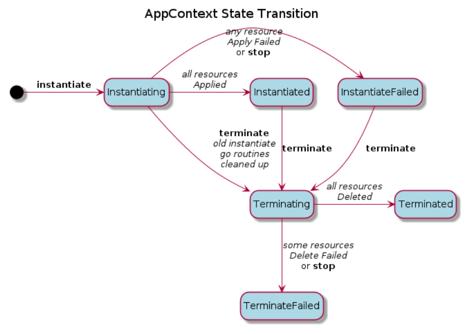

```text
SPDX-License-Identifier: Apache-2.0       
Copyright (c) 2021 Intel Corporation
```

# EMCO Resource Lifecycle and Status

This document describes how EMCO keeps track of the status of resources that have a lifecycle.  Resources with a lifecycle refer to the subset of EMCO resources that support operations like _instantiate_ or _terminate_, which result in Kubernetes\* resources being applied or deleted from remote Kuberentes clusters via the EMCO `rsync` microservice.
EMCO keeps track of the state and status of resources on the EMCO side as well as on the remote cluster.

## EMCO Resources with a Lifecycle
- Cluster Network Intents
	- Lifecycle operations are issued via the Network Configuration Manager (`ncm`) API to apply network intents (creation of provider or virtual networks) to a cluster.
- Deployment Intent Groups
	- Lifecycle operations are issued via the Distributed Application Scheduler (`orchestrator`) API to approve and instantiate composite applications which have been associated, along with a set of various intents, to a Deployment Intent Group instance.
- Logical Clouds
	- Lifecycle operations are issued via the Distributed Cluster Manager (`dcm`) to instantiate logical clouds.

### Terminology
This document will refer to _EMCO resources_, _AppContext_, _rsync resources_, and _cluster resources_.

- **EMCO resources**: These are the data resources that are input to various EMCO microservices via the REST APIs.  This data is generally input as JSON or file data and is stored in the EMCO database (i.e. MongoDB\*.) EMCO resources include the onboarded cluster registration data, logical clouds, network intents, composite application data, placement intents, action controller intents and so on.
- **AppContext**: The EMCO _AppContext_ is maintainted in the `etcd` storage used by EMCO to stage and maintain resources for composite applications, network intents and logical clouds.  Basically, all resources that are to be deployed to the remote clusters are prepared in the _AppContext_ by various EMCO microservices, and the Resource Synchronizer (`rsync`) microservice handles applying and removing those resources in the remote clusters.  Generally, for EMCO resources that support lifecycle operations, an _AppContext_ entry is created and used to manage and track all of the resources associated with the EMCO resource and status information.
- **rsync resource**: This term is used to refer to a Kubernetes resource that has been prepared by the EMCO microservices in an _AppContext_ entry.  The _rsync resource_ will have a status, managed by _rsync_ with respect to the lifecycle operations and whether or not _rsync_ has executed the operation to the associated remote cluster.
- **cluster resource**: This term is used to refer to the actual instance of a Kubernetes resource in a remote cluster.  A _cluster resource_ has an association with a  _rsync resource_, though not necessary 1:1.  For example, the _rsync resource_ may be a Deployment.  In the cluster, there would be Deployment and Pod  _cluster resources_ that get instantiated after the _rsync resource_ is applied to the cluster.

### Cluster Network Intent lifecycle

The _state_ of `Cluster Network Intents` for a cluster is  maintained in the `Cluster` resource in the EMCO database. The _state_ tracks the operations issued to the resource via the API. The states are:

-   **Created**: Upon initial creation of the cluster. In this state, `Cluster Network Intents` may be added to the `Cluster`.
-   **Applied**: Once applied, the `Cluster Network Intents` are rendered to create appropriate _rsync resources_  in the _AppContext_ and rsync is then invoked to instantiate these to the cluster to create _cluster resources_.  In this state (for now), additional network intents may not be added, modified or deleted until the current ones are terminated.  The cluster resource may not be deleted from the EMCO database until the current network intents are terminated.
```
	URL: POST /v2/cluster-providers/{cluster-provider-name}/clusters/{cluster-name}/apply
```

-   **Terminated**: Causes  _rsync_ to delete the  _cluster resources_  from the destination clusters.  This state is effectively similar to the Created state in that `Cluster Network Intents` may be added, modified or deleted.  The `Cluster` resource itself may be deleted (subject to deleting sub-resources first.)  The Applied state may also be re-invoked to start a new set of  _rsync resources_  and  _cluster resources_.
```
	URL: POST /v2/cluster-providers/{cluster-provider-name}/clusters/{cluster-name}/terminate
```

-   **InstantiateStopped**: Causes  _rsync_  to stop any current instantiation operations for the associated AppContext. When _rsync_ continues to retry instantiating _rsync resources_ to a specific cluster because it has become unreachable, the stop API may be invoked to cause the instantiate process to complete. Note that in the case where a cluster is in a retrying condition during instantiation, issuing a `terminate` to the `Cluster` will also stop the instantiation sequence before beginning the termination process.
```
	URL: POST /v2/cluster-providers/{cluster-provider-name}/clusters/{cluster-name}/stop
```

-   **TerminateStopped**: Causes  _rsync_  to stop any current termination operations for the associated AppContext. When _rsync_ continues to retry deleting _rsync resources_ from a specific cluster because it has become unreachable, the stop API may be invoked to cause the terminate process to complete. This may be necessary if it is known that the retry condition cannot be resolved and there is an intent to delete the `Cluster Network Intents` and the `Cluster`,  EMCO will prevent removal of the `Cluster` until the `Cluster Network Intents` have been terminated and the termination operation has completed (or failed).
```
	URL: POST /v2/cluster-providers/{cluster-provider-name}/clusters/{cluster-name}/stop
```


### Deployment Intent Group lifecycle

The state of the Deployment Intent Group (DIG) is maintained in the Deployment Intent Group resource in the EMCO database. This _state_ is tracking the operation issued to the resource via the API. The states are:

-   **Created**: Upon creation of the DIG, intents may be added to the DIG. The DIG may be modified or deleted.
-   **Approved**: Once the DIG is Approved, the DIG and its intents may not be modified or deleted. Modifying the DIG or its intents will unapprove the DIG and set it back to the Created state.
```
	URL: /v2/projects/{project-name}/composite-apps/{composite-app-name}/{version}/deployment-intent-groups/{deployment-intent-group-name}/approve
```

-   **Instantiated**: When the DIG is Instantiated, the  _rsync resources_  are created in the EMCO AppContext and the  _rsync_  is invoked to create the  _cluster resources_  in the destination clusters.
```
	URL: /v2/projects/{project-name}/composite-apps/{composite-app-name}/{version}/deployment-intent-groups/{deployment-intent-group-name}/instantiate
```

	Once instantiated, the DIG and its intents may not be modified or deleted. The DIG must be Terminated first.

-   **Terminated**: Causes  _rsync_  to delete the  _cluster resources_  from the destination clusters.  This state is effectively similar to the Approved state.  The Instantiated state may be re-invoked to start a new set of  _rsync resources_ and  _cluster resources_.
```
	URL: /v2/projects/{project-name}/composite-apps/{composite-app-name}/{version}/deployment-intent-groups/{deployment-intent-group-name}/terminate
```


-   **InstantiateStopped**: Causes  _rsync_  to stop any current instantiation operations for the associated AppContext.
	When _rsync_ continues to retry instantiating _rsync resources_ to a specific cluster because it has become unreachable, the stop API may be invoked to cause the instantiate process to complete.

	Note: In the case of a some clusters in a retrying condition during instantiate, issuing a terminate to the DIG will also stop the instantiate sequence before beginning the termination process.
```
	URL: /v2/projects/{project-name}/composite-apps/{composite-app-name}/{version}/deployment-intent-groups/{deployment-intent-group-name}/stop
```

-   **TerminateStopped**: Causes  _rsync_  to stop any current termination operations for the associated AppContext.
	When _rsync_ continues to retry deleting _rsync resources_ from a specific cluster because it has become unreachable, the stop API may be invoked to cause the terminate process to complete.
	This may be necessary if it is known that the retry condition cannot be resolved and there is an intent to delete the DIG.  EMCO will prevent removal of the DIG until it has been terminated and the termination operation has completed (or failed.)
```
	URL: /v2/projects/{project-name}/composite-apps/{composite-app-name}/{version}/deployment-intent-groups/{deployment-intent-group-name}/stop
```

### Logical Cloud lifecycle

In the initial EMCO release, logical clouds do not maintain the lifecycle _state_ in their EMCO resource, but the implementation effectively supports the **Create**, **Instantiate** and **Terminate** lifecycle operations.  The **Stop** operations are not supported yet.


### EMCO Resource State Diagram
The following diagram illustrates how the states of Deployment Intent Groups work.  The states of the EMCO resource (Deployment Intent Group) are shown in green.  The light blue statuses inside the Instantiated, InstantiateStopped, Terminated, and TerminateStopped states represent the status of the associated AppContext.

Note: The state diagram for cluster network intents is similar, but is lacking the Approved state, and the Instantiated is called Applied for cluster network intents.


## AppContext Status

The rsync process will maintain a top level status for the AppContext. The statuses are:

-   **Instantiating**: Once _rsync_  is invoked to instantiate an AppContext, the status will be set to _Instantiating_.
-   **Instantiated**: _Rsync_  will set the .AppContext status to _Instantiated_  after all Resources in the AppContext have been _Applied_.
-   **InstantiateFailed**: This indicates that one or more Resources _Failed_  to be applied. Or, the instantiation sequence was stopped.
-   **Terminating**: When terminate is invoked, this status will be entered directly if the AppContext is in _Instantiated_  or _InstantiateFailed_  status. If a previous Instantiating sequence is still running, the transition process includes shutting down the instantiating sequence before entering the Terminating status.
-   **Terminated**: This indicates that  _rsync_  has successfully _Deleted_  all resources.
-   **TerminateFailed**: This indicates that  _rsync_  has received a failure response for one or more Resources when attempting to delete them.  Or, the termination sequence was stopped.

The following diagram illustrates how the top level AppContext status progresses.

Note: Once an EMCO resource has been instantiated (or applied), it will have an AppContext created for it and the EMCO resource cannot be deleted until the associated AppContext has reached a Terminated or TerminateFailed status.



## Cluster Ready Status

The rsync process keeps track of each cluster status in the AppContext.  This information is presented in the status query output as the `readystatus` attribute at the cluster level.  The statuses are:

-   **Unknown**: Indicates that _rsync_ has not yet determined whether the cluster is reachable or not.
-   **Available**: Indicates that _rsync_ was able to access the cluster.
-   **Retrying**: Indicates that _rsync_ was not able to access the cluster and is retrying to perform the current operation for the resources in this cluster.

Note: the cluster ready status shows that last known status.  Once the AppContext has reached a completion state such as Instantiated, InstatiateStopped, InstantiateFailed (and similar for terminate operations), the cluster ready status will remain unchanged.
For example, if an AppContext was Instantiating and one or more clusters were in a Retrying status due to the clusters being unreachable, then if the instantiation is Stopped or times out (in the case of rsync `max-retries` being configured), the AppContext will have a status of InstantiateFailed and the cluster `readystatus` will still show as Retrying.


## _Rsync resource_  status values

The status of the  _rsync resource_  is maintained in the AppContext by  _rsync._ The status values are defined as follows.

-   **Pending**: This indicates that this resource has not been handled by _rsync_ yet.
-   **Applied**: This indicates that  _rsync_  has successfully applied the  _rsync resource_  to its destination cluster. This does not indicate anything about the actual status of the corresponding  _cluster resource(s)_  in the remote cluster.
-   **Failed**: This indicates that  _rsync_  has received a failure response when either attempting to apply or delete the  _rsync resource_  from the destination cluster. _rsync_ is taking no further action with this resource.
-   **Deleted**: This indicates that  _rsync_  has successfully deleted the  _rsync resource_ from the destination cluster. This does not indicate anything about the actual status of the corresponding  _cluster resource(s)_ in the remote cluster.

The _rsync resource_ status that is returned via the status query represents the status of the last operation that rsync has performed on this resource.  For example, consider an AppContext that has been successfully instantiated and then a terminate is issued. If at this time, a cluster is no longer reachable, the cluster `readystatus` will show up as Retrying.  The resources in this cluster will still show a status of Applied.

## _Cluster resource_ status

The status of resources deployed by  _rsync_  to clusters is monitored by aggregating their status in a Custom Resource, called the ResourceBundleState CR, which is provided along with the _monitor_ microservice.  The ResourceBundleState CR is essentially an array of about a dozen common Kubernetes kinds (eg. Pod, Deployment, Service, ConfigMap, etc.).  The _monitor_ microservice updates a given ResourceBundleState CR instance with status updates of resources in the cluster which have a label matching that instance.

1.  When  _rsync_  instantiates  _rsync resources_, it will also instantiate a ResourceBundleState CR to the remote cluster. For a given Composite Application, a ResourceBundleState CR will be deployed for each App (in the Composite App) per cluster. A label will be applied by  _rsync_ to all  _cluster resources_  of a given App and will be matched by label to the corresponding ResourceBundleState CR in the cluster. The label format is:
```
	"emco/deployment-id: < AppContext identifier>-< app-name >"
```
2.  A `monitor` pod is present in each cluster (must be installed previously) with the function to monitor all resources with the `"emco/deployement-id"` label. When it detects changes to those resources, it will update the matching ResourceBundleState CR with the details of the resource. In the example ResourceBundleState CR below, for example, all pod resources that have the label `emco/deployment-id: 171887448792644816-sink` will be included in the 'podStatuses' array.
```
apiVersion: k8splugin.io/v1alpha1
kind: ResourceBundleState
metadata:
  labels:
    emco/deployment-id: 171887448792644816-sink
  name: sink-171887448792644816
  namespace: default
spec:
  selector:
    matchLabels:
      emco/deployment-id: 171887448792644816-sink
status:
  ready: false
  resourceCount: 0
  configMapStatuses: []
  daemonSetStatuses: []
  deploymentStatuses: []
  ingressStatuses: []
  jobStatuses: []
  podStatuses: []
  secretStatuses: []
  serviceStatuses: []
  statefulSetStatuses: []
```
3.  A Watcher thread is started per cluster by _rsync_ to watch for changes to ResourceBundleState CRs in the cluster. When an updated CR is detected, the Watcher retrieves it and saves it into the corresponding AppContext per App/Cluster so it is available to provide information for _cluster resource_ queries.


The  _cluster resource_ status is provided in two forms.

1.  The `actual status{}` portion of the  _cluster resource_  (if present) is made available in the information returned via the ResourceBundleState CR.
2.  Summarized in a value as follows.

-   **Present**: For  _rsync resources_  with a corresponding  _cluster resource_  in the ResourceBundleState CR, the clustesr status is present.


### Status Query
The status query, and variations with query parameters, on an EMCO resource will present the information described previously to the caller.  The basic status query for the EMCO resources which support the status query looks like the following:

```
URL:  GET /v2/cluster-providers/{cluster-provider-name}/clusters/{cluster-name}/status

URL:  GET /v2/projects/{project-name}/composite-apps/{composite-app-name}/{version}/deployment-intent-groups/{deployment-intent-group-name}/status
```

> **NOTE** Logical clouds do yet not support the status API.


#### Status Query Parameters

The status query provides many query parameters to modify the behavior of the query.

The following query parameters are available:

`type`=< `rsync` | `cluster` >
* default type is `rsync`
* `rsync`: gathers status based on the rsync resources.
* `cluster`: gathers status based on cluster resource information received in the ResourceBundleState CRs received from the cluster(s)

`output`=< `summary` | `all` | `detail` >
* default output value is: `all`
* `summary`: will only show the top level EMCO resource state and status along with aggregated resource statuses but no resource detail information.
Any filters added will affect the aggregated resource status results, although resource details will not be displayed.
* `all`: will include a list of resources, organized by App and Cluster, showing basic resource identification (Group Version Kind) and resource statuses.
* `detail`: includes in the resource list the metadata, spec, and status of the resource as received in the ResourceBundleState CR.

`instance`=< `App Context Identifier` >
* by default, the most recent `instance` associated with the lifecycle resource will be used.
* to query results from previous instantiations, the `instance` of the older instantiation may be provided.

The following query parameters filter the results returned.  Aggregated status results at the top level are relative to the filter parameters supplied.
These parameters can be supplied multiple times in a given status query.

`app`=< `appname` >
* default is all apps
* This will filter the results of the query to show results only for the resources of the specified App(s).
* Multiple occurrences of this parameter may be supplied.

`cluster`=< `cluster` >
* default is all clusters.
* This will filter the results of the query to show results only for the specified cluster(s).
* Multiple occurrences of this parameter may be supplied.

`resource`=< `resource name` >
* default is all resources.
* This will filter the results of the query to show results only for the specified resource(s).
* Multiple occurrences of this parameter may be supplied.

The following query parameters may be included in status queries for `Deployment Intent Groups`.  If one of these parameters is present, then the status
query will make the corresponding query.  See the examples below.  Any other query parameters that are not appropriate will be ignored.

`apps`
* Return a list of all of the apps for the associated _App Context_.
* This parameter takes precedence over `clusters` and `resources` query parameters.
* The `instance` query parameter may be provided.

`clusters`
* Returns a list of clusters to which this `Deployment Intent Group` will be deployed
* This parameter takes precedence over the `resources` query parameter.
* The `app` query filter may be included to filter the response to just the clusters to which the supplied app(s) are deployed.
* The `instance` query parameter may be provided.

`resources`
* Returns a list of resources for this `Deployment Intent Group`.
* The `app` query filter may be included to filter the response to just the resources for the supplied app(s).
* The `instance` query parameter may be provided.
* The `type` parameter may be supplied to return results for either `rsync` or `cluster` resources.
* If `type`=`cluster` is provided, then the `cluster` query filter may also be provided to filter results for the suppplied cluster(s).


#### Status Query Examples

A basic status query.  By default, all apps, clusters and resources will be displayed.  The default query type is `rsync`, so the status returned indicates
the status of whether or not EMCO has successfully applied or terminated the resources (not the actual resource status in the cluster).
```
URL: GET /v2/projects/proj1/composite-apps/collection-composite-app/v1/deployment-intent-groups/collection-deployment-intent-group/status

```

Query showing just the summary information of the Deployment Intent Group.
```
URL: GET /v2/projects/proj1/composite-apps/collection-composite-app/v1/deployment-intent-groups/collection-deployment-intent-group/status?output=summary

```
Query showing the detailed status of two resources in a given cluster.
Note that the cluster is specified as the `<cluster provider name>+<cluster name>`.  The `+` character is represented in ASCII notation `%2B`.
```
URL: GET /v2/projects/proj1/composite-apps/collection-composite-app/v1/deployment-intent-groups/collection-deployment-intent-group/status?resource=alertmanagers.monitoring.coreos.com&resource=servicemonitors.monitoring.coreos.com&output=all&cluster=provider1%2Bcluster1&output=detail

```

#### Output Examples:
Illustrates the type of output that appears given various query parameters.

In the examples below, only the URL is shown.  The REST API call must be sent to the appropriate EMCO microservice which is:
`orchestratror` for `Deployment Intent Group` status queries, and `ncm` for cluster network intent status queries.

##### Example query for `apps`

Use the `apps` parameter to get the list of applications associated with a `Deployment Intent Group`.

```
URL: /v2/projects/testvfw/composite-apps/compositevfw/v1/deployment-intent-groups/vfw_deployment_intent_group/status?apps

Output:
{
  "project": "testvfw",
  "composite-app-name": "compositevfw",
  "composite-app-version": "v1",
  "composite-profile-name": "vfw_composite-profile",
  "name": "vfw_deployment_intent_group",
  "apps": [
    "firewall",
    "packetgen",
    "sink"
  ]
}
```

#### Example query for `clusters` filtered by the `sink` and `firewall` apps

Use the `clusters` parameter to get the list of all clusters by application that will be used for the deployment of a `Deployment Intent Group`.  Add `app` filters to see only the cluster(s) associated with specific app(s).


```
URL: /v2/projects/testvfw/composite-apps/compositevfw/v1/deployment-intent-groups/vfw_deployment_intent_group/status?clusters&app=sink&app=firewall

Output:
{
  "project": "testvfw",
  "composite-app-name": "compositevfw",
  "composite-app-version": "v1",
  "composite-profile-name": "vfw_composite-profile",
  "name": "vfw_deployment_intent_group",
  "clusters-by-app": [
    {
      "app": "firewall",
      "clusters": [
        {
          "cluster-provider": "vfw-cluster-provider",
          "cluster": "edge01"
        },
        {
          "cluster-provider": "vfw-cluster-provider",
          "cluster": "edge02"
        }
      ]
    },
    {
      "app": "sink",
      "clusters": [
        {
          "cluster-provider": "vfw-cluster-provider",
          "cluster": "edge01"
        },
        {
          "cluster-provider": "vfw-cluster-provider",
          "cluster": "edge02"
        }
      ]
    }
  ]
}
```

##### Example query for `resources` filtered by app `packetgen`, the default query `type`=`rsync` is used.

Use the `resources` parameter to get the list of resources and the Kubernetes Group/Version/Kind for each app.  Add the `app` filter parameter to see only the resources for a given app.  By default, the `rsync` type parameter returns the resources from the _App Context_ that has been prepared by EMCO.

```
URL: /v2/projects/testvfw/composite-apps/compositevfw/v1/deployment-intent-groups/vfw_deployment_intent_group/status?resources&app=packetgen

Output:
{
  "project": "testvfw",
  "composite-app-name": "compositevfw",
  "composite-app-version": "v1",
  "composite-profile-name": "vfw_composite-profile",
  "name": "vfw_deployment_intent_group",
  "resources-by-app": [
    {
      "app": "packetgen",
      "resources": [
        {
          "name": "fw0-packetgen",
          "GVK": {
            "Group": "apps",
            "Version": "v1",
            "Kind": "Deployment"
          }
        },
        {
          "name": "packetgen-service",
          "GVK": {
            "Group": "",
            "Version": "v1",
            "Kind": "Service"
          }
        }
      ]
    }
  ]
}
```

##### Example query for `resources` filtered by app `packetgen`, query `type`=`cluster` to get resources from the clusters.

When using the `resources` parameter, specify the `cluster` type parameter to return the resources for the apps that have been instantiated in the remote clusters.  This is useful to find the names of `Pod` resources that have been created in the remote clusters.
In this case, the `cluster` filter parameter may also be supplied to limit results to a specified set of clusters.

```
URL: /v2/projects/testvfw/composite-apps/compositevfw/v1/deployment-intent-groups/vfw_deployment_intent_group/status?resources&type=cluster&app=packetgen

Output:
{
  "project": "testvfw",
  "composite-app-name": "compositevfw",
  "composite-app-version": "v1",
  "composite-profile-name": "vfw_composite-profile",
  "name": "vfw_deployment_intent_group",
  "resources-by-app": [
    {
      "app": "packetgen",
      "cluster-provider": "vfw-cluster-provider",
      "cluster": "edge01",
      "resources": [
        {
          "name": "fw0-packetgen-5fd8b6db69-x55vx",
          "GVK": {
            "Group": "",
            "Version": "v1",
            "Kind": "Pod"
          }
        },
        {
          "name": "packetgen-service",
          "GVK": {
            "Group": "",
            "Version": "v1",
            "Kind": "Service"
          }
        },
        {
          "name": "fw0-packetgen",
          "GVK": {
            "Group": "apps",
            "Version": "v1",
            "Kind": "Deployment"
          }
        }
      ]
    },
    {
      "app": "packetgen",
      "cluster-provider": "vfw-cluster-provider",
      "cluster": "edge02",
      "resources": [
        {
          "name": "fw0-packetgen-5fd8b6db69-mz8fd",
          "GVK": {
            "Group": "",
            "Version": "v1",
            "Kind": "Pod"
          }
        },
        {
          "name": "packetgen-service",
          "GVK": {
            "Group": "",
            "Version": "v1",
            "Kind": "Service"
          }
        },
        {
          "name": "fw0-packetgen",
          "GVK": {
            "Group": "apps",
            "Version": "v1",
            "Kind": "Deployment"
          }
        }
      ]
    }
  ]
}
```

##### Example query for `resources` filtered by app `sink`, query `type`=`cluster` to get resources from the clusters, filter by cluster `edge02`

```
URL: /v2/projects/testvfw/composite-apps/compositevfw/v1/deployment-intent-groups/vfw_deployment_intent_group/status?resources&type=cluster&app=sink&cluster=vfw-cluster-provider%2Bedge02

Output:
{
  "project": "testvfw",
  "composite-app-name": "compositevfw",
  "composite-app-version": "v1",
  "composite-profile-name": "vfw_composite-profile",
  "name": "vfw_deployment_intent_group",
  "resources-by-app": [
    {
      "app": "sink",
      "cluster-provider": "vfw-cluster-provider",
      "cluster": "edge02",
      "resources": [
        {
          "name": "fw0-sink-8b7557f65-ppkfp",
          "GVK": {
            "Group": "",
            "Version": "v1",
            "Kind": "Pod"
          }
        },
        {
          "name": "sink-service",
          "GVK": {
            "Group": "",
            "Version": "v1",
            "Kind": "Service"
          }
        },
        {
          "name": "fw0-sink",
          "GVK": {
            "Group": "apps",
            "Version": "v1",
            "Kind": "Deployment"
          }
        },
        {
          "name": "sink-configmap",
          "GVK": {
            "Group": "",
            "Version": "v1",
            "Kind": "ConfigMap"
          }
        }
      ]
    }
  ]
}
```

##### Example summary query

The `summary` output parameter returns the top level information about the resource, the history of `state` operations that have been performed on the resource, the _App Context_ status of the resource and a summary of the resource statuses.
The resource summary depends on whether the `rsync` or `cluster` type parameter is provided.

The `states` object in the response contains a `statusctxid` attribute.  The value of this attribute is the default _App Context_ `instance` value used for the status query.  This value corresponds to the `instance` associated with the most recent `Instantiated` state of the resource (in the event that there is more than one).

```
URL: /v2/projects/testvfw/composite-apps/compositevfw/v1/deployment-intent-groups/vfw_deployment_intent_group/status?output=summary

Output:
{
  "project": "testvfw",
  "composite-app-name": "compositevfw",
  "composite-app-version": "v1",
  "composite-profile-name": "vfw_composite-profile",
  "name": "vfw_deployment_intent_group",
  "states": {
    "statusctxid": "8042348702892447990",
    "actions": [
      {
        "state": "Created",
        "instance": "",
        "time": "2021-07-12T16:29:55.451Z",
        "revision": 0
      },
      {
        "state": "Approved",
        "instance": "",
        "time": "2021-07-12T19:07:38.808Z",
        "revision": 0
      },
      {
        "state": "Instantiated",
        "instance": "8042348702892447990",
        "time": "2021-07-12T19:07:39.85Z",
        "revision": 1
      }
    ]
  },
  "status": "Instantiated",
  "rsync-status": {
    "Applied": 16
  }
}
```

##### Example query with default parameters

```
URL:/v2/projects/testvfw/composite-apps/compositevfw/v1/deployment-intent-groups/vfw_deployment_intent_group/status
{
  "composite-app-name": "compositevfw",
  "composite-app-version": "v1",
  "composite-profile-name": "vfw_composite-profile",
  "name": "vfw_deployment_intent_group",
  "states": {
    "statusctxid": "8042348702892447990",
    "actions": [
      {
        "state": "Created",
        "instance": "",
        "time": "2021-07-12T16:29:55.451Z",
        "revision": 0
      },
      {
        "state": "Approved",
        "instance": "",
        "time": "2021-07-12T19:07:38.808Z",
        "revision": 0
      },
      {
        "state": "Instantiated",
        "instance": "8042348702892447990",
        "time": "2021-07-12T19:07:39.85Z",
        "revision": 1
      }
    ]
  },
  "status": "Instantiated",
  "rsync-status": {
    "Applied": 16
  },
  "apps": [
    {
      "name": "firewall",
      "clusters": [
        {
          "cluster-provider": "vfw-cluster-provider",
          "cluster": "edge01",
          "readystatus": "Available",
          "resources": [
            {
              "GVK": {
                "Group": "",
                "Version": "v1",
                "Kind": "ConfigMap"
              },
              "name": "firewall-scripts-configmap",
              "rsync-status": "Applied"
            },
            {
              "GVK": {
                "Group": "apps",
                "Version": "v1",
                "Kind": "Deployment"
              },
              "name": "fw0-firewall",
              "rsync-status": "Applied"
            }
          ]
        },
        {
          "cluster-provider": "vfw-cluster-provider",
          "cluster": "edge02",
          "readystatus": "Available",
          "resources": [
            {
              "GVK": {
                "Group": "",
                "Version": "v1",
                "Kind": "ConfigMap"
              },
              "name": "firewall-scripts-configmap",
              "rsync-status": "Applied"
            },
            {
              "GVK": {
                "Group": "apps",
                "Version": "v1",
                "Kind": "Deployment"
              },
              "name": "fw0-firewall",
              "rsync-status": "Applied"
            }
          ]
        }
      ]
    },
    {
      "name": "packetgen",
      "clusters": [
        {
          "cluster-provider": "vfw-cluster-provider",
          "cluster": "edge01",
          "readystatus": "Available",
          "resources": [
            {
              "GVK": {
                "Group": "apps",
                "Version": "v1",
                "Kind": "Deployment"
              },
              "name": "fw0-packetgen",
              "rsync-status": "Applied"
            },
            {
              "GVK": {
                "Group": "",
                "Version": "v1",
                "Kind": "ConfigMap"
              },
              "name": "packetgen-scripts-configmap",
              "rsync-status": "Applied"
            },
            {
              "GVK": {
                "Group": "",
                "Version": "v1",
                "Kind": "Service"
              },
              "name": "packetgen-service",
              "rsync-status": "Applied"
            }
          ]
        },
        {
          "cluster-provider": "vfw-cluster-provider",
          "cluster": "edge02",
          "readystatus": "Available",
          "resources": [
            {
              "GVK": {
                "Group": "apps",
                "Version": "v1",
                "Kind": "Deployment"
              },
              "name": "fw0-packetgen",
              "rsync-status": "Applied"
            },
            {
              "GVK": {
                "Group": "",
                "Version": "v1",
                "Kind": "ConfigMap"
              },
              "name": "packetgen-scripts-configmap",
              "rsync-status": "Applied"
            },
            {
              "GVK": {
                "Group": "",
                "Version": "v1",
                "Kind": "Service"
              },
              "name": "packetgen-service",
              "rsync-status": "Applied"
            }
          ]
        }
      ]
    },
    {
      "name": "sink",
      "clusters": [
        {
          "cluster-provider": "vfw-cluster-provider",
          "cluster": "edge01",
          "readystatus": "Available",
          "resources": [
            {
              "GVK": {
                "Group": "apps",
                "Version": "v1",
                "Kind": "Deployment"
              },
              "name": "fw0-sink",
              "rsync-status": "Applied"
            },
            {
              "GVK": {
                "Group": "",
                "Version": "v1",
                "Kind": "ConfigMap"
              },
              "name": "sink-scripts-configmap",
              "rsync-status": "Applied"
            },
            {
              "GVK": {
                "Group": "",
                "Version": "v1",
                "Kind": "Service"
              },
              "name": "sink-service",
              "rsync-status": "Applied"
            }
          ]
        },
        {
          "cluster-provider": "vfw-cluster-provider",
          "cluster": "edge02",
          "readystatus": "Available",
          "resources": [
            {
              "GVK": {
                "Group": "apps",
                "Version": "v1",
                "Kind": "Deployment"
              },
              "name": "fw0-sink",
              "rsync-status": "Applied"
            },
            {
              "GVK": {
                "Group": "",
                "Version": "v1",
                "Kind": "ConfigMap"
              },
              "name": "sink-scripts-configmap",
              "rsync-status": "Applied"
            },
            {
              "GVK": {
                "Group": "",
                "Version": "v1",
                "Kind": "Service"
              },
              "name": "sink-service",
              "rsync-status": "Applied"
            }
          ]
        }
      ]
    }
  ]
}
```

##### Example with a cluster filter parameter

Note that when filters are applied, the total number of resources in the top level resource summary section will also be reduced accordingly.

```
URL: /v2/projects/testvfw/composite-apps/compositevfw/v1/deployment-intent-groups/vfw_deployment_intent_group/status?cluster=vfw-cluster-provider%2Bedge02

Output:
{
  "project": "testvfw",
  "composite-app-name": "compositevfw",
  "composite-app-version": "v1",
  "composite-profile-name": "vfw_composite-profile",
  "name": "vfw_deployment_intent_group",
  "states": {
    "statusctxid": "8042348702892447990",
    "actions": [
      {
        "state": "Created",
        "instance": "",
        "time": "2021-07-12T16:29:55.451Z",
        "revision": 0
      },
      {
        "state": "Approved",
        "instance": "",
        "time": "2021-07-12T19:07:38.808Z",
        "revision": 0
      },
      {
        "state": "Instantiated",
        "instance": "8042348702892447990",
        "time": "2021-07-12T19:07:39.85Z",
        "revision": 1
      }
    ]
  },
  "status": "Instantiated",
  "rsync-status": {
    "Applied": 8
  },
  "apps": [
    {
      "name": "firewall",
      "clusters": [
        {
          "cluster-provider": "vfw-cluster-provider",
          "cluster": "edge02",
          "readystatus": "Available",
          "resources": [
            {
              "GVK": {
                "Group": "",
                "Version": "v1",
                "Kind": "ConfigMap"
              },
              "name": "firewall-scripts-configmap",
              "rsync-status": "Applied"
            },
            {
              "GVK": {
                "Group": "apps",
                "Version": "v1",
                "Kind": "Deployment"
              },
              "name": "fw0-firewall",
              "rsync-status": "Applied"
            }
          ]
        }
      ]
    },
    {
      "name": "packetgen",
      "clusters": [
        {
          "cluster-provider": "vfw-cluster-provider",
          "cluster": "edge02",
          "readystatus": "Available",
          "resources": [
            {
              "GVK": {
                "Group": "apps",
                "Version": "v1",
                "Kind": "Deployment"
              },
              "name": "fw0-packetgen",
              "rsync-status": "Applied"
            },
            {
              "GVK": {
                "Group": "",
                "Version": "v1",
                "Kind": "ConfigMap"
              },
              "name": "packetgen-scripts-configmap",
              "rsync-status": "Applied"
            },
            {
              "GVK": {
                "Group": "",
                "Version": "v1",
                "Kind": "Service"
              },
              "name": "packetgen-service",
              "rsync-status": "Applied"
            }
          ]
        }
      ]
    },
    {
      "name": "sink",
      "clusters": [
        {
          "cluster-provider": "vfw-cluster-provider",
          "cluster": "edge02",
          "readystatus": "Available",
          "resources": [
            {
              "GVK": {
                "Group": "apps",
                "Version": "v1",
                "Kind": "Deployment"
              },
              "name": "fw0-sink",
              "rsync-status": "Applied"
            },
            {
              "GVK": {
                "Group": "",
                "Version": "v1",
                "Kind": "ConfigMap"
              },
              "name": "sink-scripts-configmap",
              "rsync-status": "Applied"
            },
            {
              "GVK": {
                "Group": "",
                "Version": "v1",
                "Kind": "Service"
              },
              "name": "sink-service",
              "rsync-status": "Applied"
            }
          ]
        }
      ]
    }
  ]
}

```

##### Example of a status query for a Pod in a cluster

Having previously queried for the `resources` in a cluster to get the name of the Pod, now query for details about the Pod.
Use the `detail` output parameter to get more information about the resource.

```
URL: /v2/projects/testvfw/composite-apps/compositevfw/v1/deployment-intent-groups/vfw_deployment_intent_group/status?type=cluster\&resource=fw0-sink-b866bfddf-2jkpd&output=detail

Output:
{
  "project": "testvfw",
  "composite-app-name": "compositevfw",                                                                                                                                                                                                                                         "composite-app-version": "v1",
  "composite-profile-name": "vfw_composite-profile",
  "name": "vfw_deployment_intent_group",
  "states": {
    "statusctxid": "8042348702892447990",
    "actions": [
      {
        "state": "Created",
        "instance": "",
        "time": "2021-07-12T16:29:55.451Z",
        "revision": 0
      },
      {
        "state": "Approved",
        "instance": "",
        "time": "2021-07-12T19:07:38.808Z",
        "revision": 0
      },
      {
        "state": "Instantiated",
        "instance": "8042348702892447990",
        "time": "2021-07-12T19:07:39.85Z",
        "revision": 1
      }
    ]
  },
  "status": "Instantiated",
  "cluster-status": {
    "Present": 1
  },
  "apps": [
    {
      "name": "sink",
      "clusters": [
        {
          "cluster-provider": "vfw-cluster-provider",
          "cluster": "edge02",
          "readystatus": "Available",
          "resources": [
            {
              "GVK": {
                "Group": "",
                "Version": "v1",
                "Kind": "Pod"
              },
              "name": "fw0-sink-b866bfddf-2jkpd",
              "detail": {
                "kind": "Pod",
                "apiVersion": "v1",
                "metadata": {
                  "name": "fw0-sink-b866bfddf-2jkpd",
                  "generateName": "fw0-sink-b866bfddf-",
                  "namespace": "default",
                  "selfLink": "/api/v1/namespaces/default/pods/fw0-sink-b866bfddf-2jkpd",
                  "uid": "b6fccb5b-70eb-4cdd-b252-9accbe18662f",
                  "resourceVersion": "10432153",
                  "creationTimestamp": "2021-07-12T19:07:41Z",
                  "labels": {
                    "app": "sink",
                    "emco/deployment-id": "8042348702892447990-sink",
                    "pod-template-hash": "b866bfddf",
                    "release": "fw0"
                  },
                  "annotations": {
                    "container.apparmor.security.beta.kubernetes.io/sink": "runtime/default",
                    "k8s.plugin.opnfv.org/nfn-network": "{\"type\":\"ovn4nfv\",\"interface\":[{\"interface\":\"eth2\",\"name\":\"emco-private-net\",\"defaultGateway\":\"false\",\"ipAddress\":\"10.10.20.4\"},{\"interface\":\"eth1\",\"name\":\"protected-private-net\",\"defaultGateway\":\"false\",\"ipAddress\":\"192.168.20.3\"}]}",
                    "k8s.v1.cni.cncf.io/networks": "[{\"name\":\"ovn-networkobj\",\"namespace\":\"default\",\"cni-args\":null}]",
                    "kubernetes.io/psp": "restricted",
                    "seccomp.security.alpha.kubernetes.io/pod": "runtime/default"
                  },
                  "ownerReferences": [
                    {
                      "apiVersion": "apps/v1",
                      "kind": "ReplicaSet",
                      "name": "fw0-sink-b866bfddf",
                      "uid": "cf54e7a7-c6c2-4ddd-aaa4-a1b255581a31",
                      "controller": true,
                      "blockOwnerDeletion": true
                    }
                  ],
                << DETAILS SNIPPED OUT FOR BREVITY >>
                "status": {
                  "phase": "Running",
                  "conditions": [
                    {
                      "type": "Initialized",
                      "status": "True",
                      "lastProbeTime": null,
                      "lastTransitionTime": "2021-07-12T19:07:41Z"
                    },
                    {
                      "type": "Ready",
                      "status": "True",
                      "lastProbeTime": null,
                      "lastTransitionTime": "2021-07-12T19:07:47Z"
                    },
                    {
                      "type": "ContainersReady",
                      "status": "True",
                      "lastProbeTime": null,
                      "lastTransitionTime": "2021-07-12T19:07:47Z"
                    },
                    {
                      "type": "PodScheduled",
                      "status": "True",
                      "lastProbeTime": null,
                      "lastTransitionTime": "2021-07-12T19:07:41Z"
                    }
                  ],
                  "hostIP": "10.0.2.15",
                  "podIP": "10.244.64.130",
                  "podIPs": [
                    {
                      "ip": "10.244.64.130"
                    }
                  ],
                  "startTime": "2021-07-12T19:07:41Z",
                  "containerStatuses": [
                    {
                      "name": "sink",
                      "state": {
                        "running": {
                          "startedAt": "2021-07-12T19:07:46Z"
                        }
                      },
                      "lastState": {},
                      "ready": true,
                      "restartCount": 0,
                      "image": "ubuntu:18.04",
                      "imageID": "docker-pullable://ubuntu@sha256:04919776d30640ce4ed24442d5f7c1a8e4bd0e4793ed9469843cedaecb0d72fb",
                      "containerID": "docker://3c997bd33ccc08967de278a09b3fe03767225082d948d76f7bbed4f014843e9f",
                      "started": true
                    }
                  ],
                  "qosClass": "Guaranteed"
                }
              }
            }
          ]
        }
      ]
    }
  ]
}
```

##### Example of a cluster network intents status query

This example illustrates querying the status of a network intents for a cluster.
The same query parameters, except for the `apps`, `clusters` and `resources` parameters, apply as illustrated above for querying `Deployment Intent Groups`.

Note: the `cluster` and `app` filter parameters are not particularly useful for the cluster network intents status query since cluster is inherent in the query URL and there is only
a single internal app for any given cluster network intent and it is not dislayed.

Note: if the `cluster` type parameter is supplied, the ResourceBundleState CR currently does not support the Network and ProviderNetwork resources, so no resources will be found

Note: the format of the cluster intents status query changed in 21.03.  The `apps` and `clusters` levels have been removed since they are effectively
redundant for this query. They have been replaced with a single `cluster` object which contains the list of network resources.

```
URL: /v2/cluster-providers/vfw-cluster-provider/clusters/edge01/status
{
  "name": "vfw-cluster-provider+edge01",
  "states": {
    "statusctxid": "8944361756792484902",
    "actions": [
      {
        "state": "Created",
        "instance": "",
        "time": "2021-07-12T16:29:54.704Z",
        "revision": 0
      },
      {
        "state": "Applied",
        "instance": "8944361756792484902",
        "time": "2021-07-12T19:07:28.871Z",
        "revision": 0
      }
    ]
  },
  "status": "Instantiated",
  "rsync-status": {
    "Applied": 3
  },
  "cluster": {
    "cluster-provider": "vfw-cluster-provider",
    "cluster": "edge01",
    "readystatus": "Available",
    "resources": [
      {
        "GVK": {
          "Group": "k8s.plugin.opnfv.org",
          "Version": "v1alpha1",
          "Kind": "ProviderNetwork"
        },
        "name": "emco-private-net",
        "rsync-status": "Applied"
      },
      {
        "GVK": {
          "Group": "k8s.plugin.opnfv.org",
          "Version": "v1alpha1",
          "Kind": "ProviderNetwork"
        },
        "name": "protected-private-net",
        "rsync-status": "Applied"
      },
      {
        "GVK": {
          "Group": "k8s.plugin.opnfv.org",
          "Version": "v1alpha1",
          "Kind": "ProviderNetwork"
        },
        "name": "unprotected-private-net",
        "rsync-status": "Applied"
      }
    ]
  }
}
```

#### Status Query Examples Using the `emcoctl` Utility

This section provides a couple examples to illustrate how `emcoctl` is used to make status queries.

##### Example of a Basic Status Query with Default Query Parameters

```
$ emcoctl --config emco-cfg.yaml get projects/testvfw/composite-apps/compositevfw/v1/deployment-intent-groups/vfw_deployment_intent_group/status
Using config file: emco-cfg.yaml
---
GET  --> URL: http://10.10.10.6:30415/v2/projects/testvfw/composite-apps/compositevfw/v1/deployment-intent-groups/vfw_deployment_intent_group/status
Response Code: 200
Response: {"project":"testvfw","composite-app-name":"compositevfw","composite-app-version":"v1","composite-profile-name":"vfw_composite-profile","name":"vfw_deployment_intent_group","states":{"statusctxid":"8042348702892447990","actions":[{"state":"Created","instance":"","time":"2021-07-12T16:29:55.451Z","revision":0},{"state":"Approved","instance":"","time":"2021-07-12T19:07:38.808Z","revision":0},{"state":"Instantiated","instance":"8042348702892447990","time":"2021-07-12T19:07:39.85Z","revision":1}]},"status":"Instantiated","rsync-status":{"Applied":16},"apps":[{"name":"firewall","clusters":[{"cluster-provider":"vfw-cluster-provider","cluster":"edge01","readystatus":"Available","resources":[{"GVK":{"Group":"","Version":"v1","Kind":"ConfigMap"},"name":"firewall-scripts-configmap","rsync-status":"Applied"},{"GVK":{"Group":"apps","Version":"v1","Kind":"Deployment"},"name":"fw0-firewall","rsync-status":"Applied"}]},{"cluster-provider":"vfw-cluster-provider","cluster":"edge02","readystatus":"Available","resources":[{"GVK":{"Group":"","Version":"v1","Kind":"ConfigMap"},"name":"firewall-scripts-configmap","rsync-status":"Applied"},{"GVK":{"Group":"apps","Version":"v1","Kind":"Deployment"},"name":"fw0-firewall","rsync-status":"Applied"}]}]},{"name":"packetgen","clusters":[{"cluster-provider":"vfw-cluster-provider","cluster":"edge01","readystatus":"Available","resources":[{"GVK":{"Group":"apps","Version":"v1","Kind":"Deployment"},"name":"fw0-packetgen","rsync-status":"Applied"},{"GVK":{"Group":"","Version":"v1","Kind":"ConfigMap"},"name":"packetgen-scripts-configmap","rsync-status":"Applied"},{"GVK":{"Group":"","Version":"v1","Kind":"Service"},"name":"packetgen-service","rsync-status":"Applied"}]},{"cluster-provider":"vfw-cluster-provider","cluster":"edge02","readystatus":"Available","resources":[{"GVK":{"Group":"apps","Version":"v1","Kind":"Deployment"},"name":"fw0-packetgen","rsync-status":"Applied"},{"GVK":{"Group":"","Version":"v1","Kind":"ConfigMap"},"name":"packetgen-scripts-configmap","rsync-status":"Applied"},{"GVK":{"Group":"","Version":"v1","Kind":"Service"},"name":"packetgen-service","rsync-status":"Applied"}]}]},{"name":"sink","clusters":[{"cluster-provider":"vfw-cluster-provider","cluster":"edge01","readystatus":"Available","resources":[{"GVK":{"Group":"apps","Version":"v1","Kind":"Deployment"},"name":"fw0-sink","rsync-status":"Applied"},{"GVK":{"Group":"","Version":"v1","Kind":"ConfigMap"},"name":"sink-scripts-configmap","rsync-status":"Applied"},{"GVK":{"Group":"","Version":"v1","Kind":"Service"},"name":"sink-service","rsync-status":"Applied"}]},{"cluster-provider":"vfw-cluster-provider","cluster":"edge02","readystatus":"Available","resources":[{"GVK":{"Group":"apps","Version":"v1","Kind":"Deployment"},"name":"fw0-sink","rsync-status":"Applied"},{"GVK":{"Group":"","Version":"v1","Kind":"ConfigMap"},"name":"sink-scripts-configmap","rsync-status":"Applied"},{"GVK":{"Group":"","Version":"v1","Kind":"Service"},"name":"sink-service","rsync-status":"Applied"}]}]}]}

```

TIP: To get just the JSON output to pass to a JSON utility like `jq`, do something like the following:

```
emcoctl --config emco-cfg.yaml get projects/testvfw/composite-apps/compositevfw/v1/deployment-intent-groups/vfw_deployment_intent_group/status | sed -z 's/.*Response://' | jq .
```

##### Example Showing Multiple Status Query Parameters with `emcoctl`

```
emcoctl --config emco-cfg.yaml get projects/testvfw/composite-apps/compositevfw/v1/deployment-intent-groups/vfw_deployment_intent_group/status?resources\&type=cluster\&app=sink\&cluster=vfw-cluster-provider%2Bedge02

```
