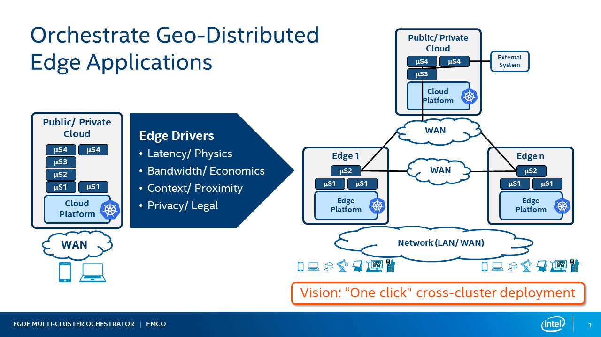
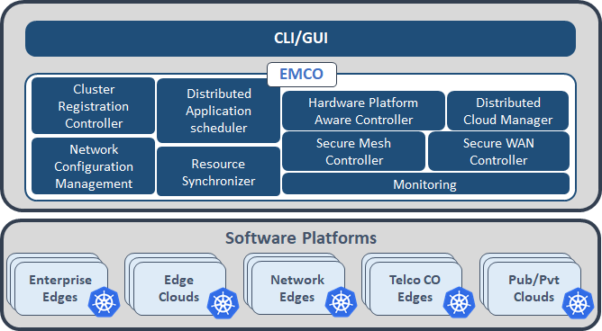
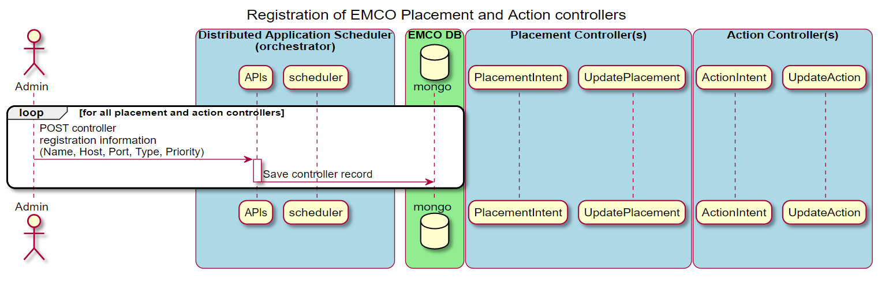
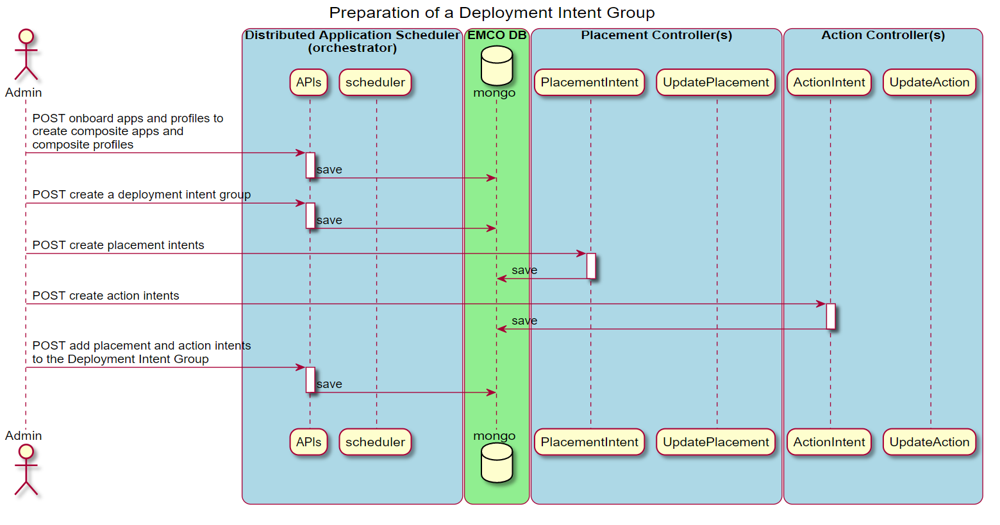
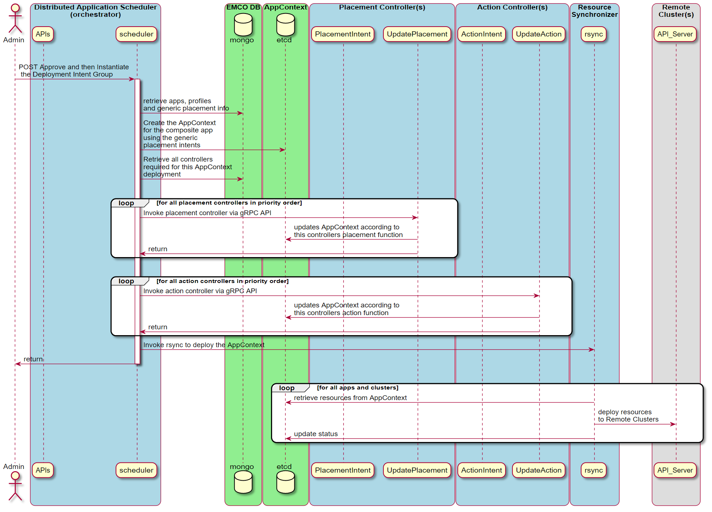
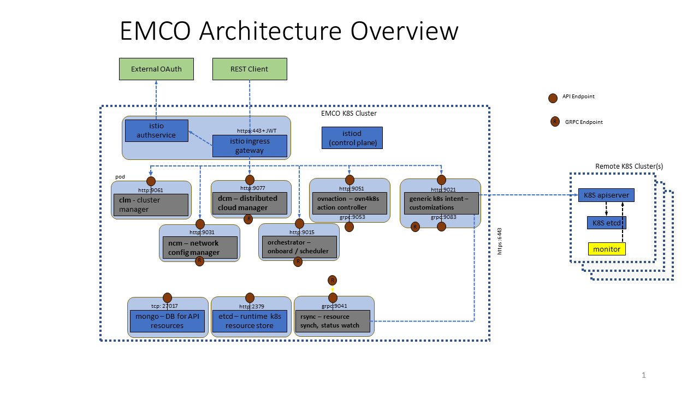
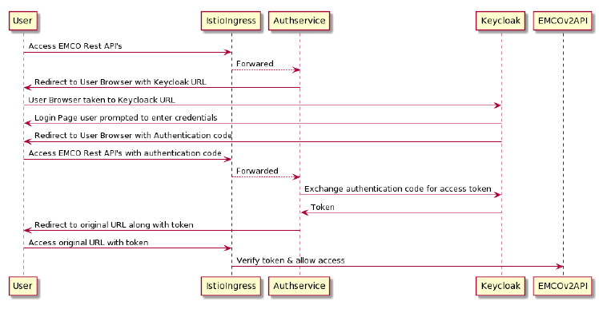
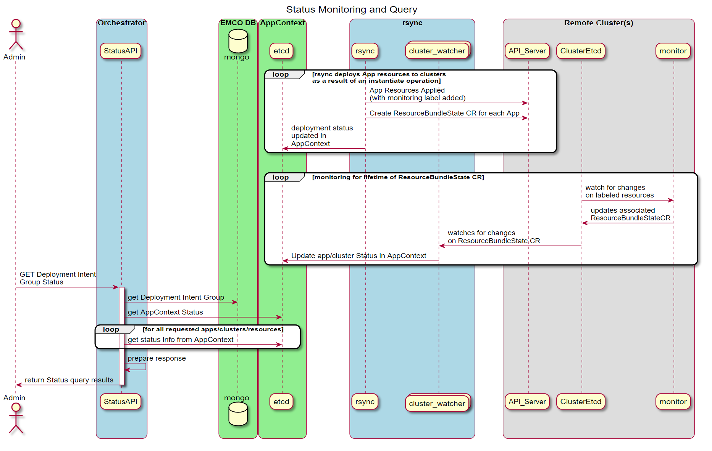

```text
SPDX-License-Identifier: Apache-2.0
Copyright (c) 2020-2021 Intel Corporation
```
<!-- omit in toc -->
# Edge Multi-Cluster Orchestrator (EMCO)

- [Background](#background)
- [EMCO Introduction](#emco-introduction)
  - [EMCO Terminology](#emco-terminology)
  - [EMCO Architecture](#emco-architecture)
    - [Cluster Registration](#cluster-registration)
    - [Distributed Application Scheduler](#distributed-application-scheduler)
      - [Lifecycle Operations](#lifecycle-operations)
    - [Network Configuration Management](#network-configuration-management)
      - [Lifecycle Operations](#lifecycle-operations-1)
    - [Distributed Cloud Manager](#distributed-cloud-manager)
      - [Lifecycle Operations](#lifecycle-operations-2)
      - [Standard Logical Clouds](#standard-logical-clouds)
      - [Admin Logical Clouds](#admin-logical-clouds)
      - [Privileged Logical Clouds](#privileged-logical-clouds)
    - [OVN Action Controller](#ovn-action-controller)
    - [Traffic Controller](#traffic-controller)
    - [Generic Action Controller](#generic-action-controller)
    - [Resource Synchronizer](#resource-synchronizer)
    - [Placement and Action Controllers in EMCO](#placement-and-action-controllers-in-emco)
    - [Status Monitoring and Queries in EMCO](#status-monitoring-and-queries-in-emco)
  - [EMCO Terminology](#emco-terminology-1)
  - [EMCO API](#emco-api)
  - [EMCO Authentication and Authorization](#emco-authentication-and-authorization)

## Background
Edge Multi-Cluster Orchestration(EMCO), is a geo-distributed application orchestrator for Kubernetes\*. EMCO operates at a higher level than Kubernetes and interacts with multiple edge servers and clouds that are running Kubernetes. EMCO's main objective is to automate  the deployment of applications and services across multiple clusters. It acts as a central orchestrator that can manage edge services and network functions across geographically distributed edge clusters from different third parties.

Increasingly we see a requirement for deploying 'composite applications' in multiple geographical locations. Some of the catalysts for this change are:

-  Latency - requirements for new low latency application use cases such as AR/VR. Ultra low latency response is needed in IIOT for example. This requires supporting some of the application functionality on edges closer to the user.
-  Bandwidth - processing data on edges avoids the costs associated with transporting the data to clouds for processing.
-  Context/Promixity - running some part of the application on edge servers near the user when they require local context
-  Privacy/Legal - some data may have a legal requirement to remain in a geographic location.


_Figure 1 - Orchestrate GeoDistributed Edge Applications_

> **NOTE**: A 'composite application' is a combination of multiple applications with each application packaged as a Helm Chart. Based on the deployment intent, various applications of the composite application get deployed at various locations, and get replicated in multiple locations.

The life cycle management of composite applications is complex. Instantiation, updates and terminations of the composite application across multiple K8s clusters (edges and clouds), monitoring the status of the composite application deployment, Day 2 operations (modification of the deployment intent, upgrades, etc..) are a few examples of these complex operations.

For a given use case, the number of K8s clusters (edges or clouds) could be in tens of thousands. The number of composite applications that need to be managed could be in the hundreds. The number of applications in a composite application could be in the tens.  The number of micro-services in each application of the composite application can be in the tens. Moreover, there can be multiple deployments of the same composite application for different purposes. To reduce this complexity, all of these operations can be automated.A Multi-Edge and Multi-Cloud distributed application orchestrator enables one-click deployment of the composite applications and makes a one simple dashboard to know the status of the composite application deployment at any time possible.

Compared with other multiple-cluster orchestration, EMCO focuses on the following functionalities:
- Enrolling multiple geographically distributed clusters.
- Orchestrating composite applications (composed of multiple individual applications) across different clusters.
- Deploying edge services and network functions to different nodes spread across different clusters.
- Monitoring the health of the deployed edge services and network functions across different clusters.
- Orchestrating edge services and network functions with deployment intents based on compute, acceleration, and storage requirements.
- Supporting multiple tenants from different enterprises while ensuring confidentiality and full isolation between the tenants.

## EMCO Introduction

### EMCO Terminology

|                        |                                                                                                                                  |
|------------------------|----------------------------------------------------------------------------------------------------------------------------------|
| Cluster Provider       | The cluster provider is someone who owns  and registers clusters.                                                                    |
| Projects               | The project resource provides means to group a collection of applications.                                              |
|                        | Several applications can exist under a specific project.                                                                         |
|                        | Projects allow for defining of the grouping of applications under a common tenant.                                                |
| Composite Application  | Composite application is a combination of multiple applications.                                                                   |
|                        | Based on the deployment intent, various applications of the composite application are deployed at various locations.             |
|                        | Some applications of the composite application can be replicated in multiple locations.                                       |
| Deployment Intent      | EMCO does not expect the editing of Helm Charts provided by application/Network-function vendors by DevOps admins.               |
|                        | Any customization and additional K8s resources that need to be present with the application are specified as deployment intents. |
| Placement Intent       | EMCO supports creating generic placement intents for a given composite application.                                             |
|                        | Normally, the EMCO scheduler calls placement controllers first to determine the edge/cloud locations for a given application.       |
|                        | It then works with the 'resource synchronizer & status collector' to deploy K8s resources on various Edge/Cloud clusters.            |
| AppContext             | The AppContext is a set of records maintained in the EMCO `etcd` data store which maintains the collection of resources & clusters |
|                        | AppContext is associated with a deployable EMCO resource (e.g. Deployment Intent Group)                                          |


### EMCO Architecture
The following diagram depicts a high level overview of the EMCO architecture.




_Figure 2 - EMCO Architecture_

- Cluster Registration Controller registers clusters by cluster owners.
- Distributed Application Scheduler provide simplified and extensible placement.
- Network Configuration Management handles creation and management of virtual and provider networks.
- Hardware Platform Aware Controller enables scheduling with auto-discovery of platform features/ capabilities.
- Distributed Cloud Manager presents a single logical cloud from multiple edges.
- Secure Mesh Controller auto-configures both service mesh (ISTIO) and security policy (NAT, firewall).
- Secure WAN Controller automates secure overlays across edge groups.
- Resource Syncronizer manages instantiation of resources to clusters.
- Monitoring covers distributed applications.

#### Cluster Registration
A microservice exposes a RESTful API. Users can register cluster providers and their associated clusters through these APIs. After preparing edge clusters and cloud clusters, which can be any Kubernetes cluster, users can onboard those clusters to EMCO by creating a cluster provider and then adding clusters to the cluster provider. After cluster providers are created, the KubeConfig files of the edge and cloud clusters should be provided to EMCO as part of the multi-part POST call to the Cluster API.

Additionally, after a cluster is created, labels and key value pairs can be added to the cluster via the EMCO API. Clusters can be specified by label when preparing placement intents.
> **NOTE**: The cluster provider is someone who owns clusters and registers them to EMCO. If an Enterprise has clusters, for example from AWS, then the cluster provider for those clusters from AWS is still considered as from that Enterprise. AWS is not the provider. Here, the provider is someone who owns clusters and registers them to EMCO. Since AWS does not register their clusters to EMCO, AWS is not considered the cluster provider in this context.

#### Distributed Application Scheduler
The distributed application scheduler microservice functionality includes:
- Project Management which provides multi-tenancy in the application from a user perspective.
- Composite App Management manages composite apps that are collections of Helm Charts, one per application.
- Composite Profile Management manages composite profiles that are collections of profile, one per application.
- Deployment Intent Group Management manages Intents for composite applications.
- Controller Registration manages placement and action controller registration, priorities etc.
- Status Notifier framework allows user to get on-demand status updates or notifications on status updates.
- Scheduler:
  - Placement Controllers: Generic Placement Controller.
  - Action Controllers.

##### Lifecycle Operations
The Distributed Application Scheduler supports operations on a deployment intent group resource to instantiate the associated composite application with any placement, and action intents performed by the registered placement and action controllers. The basic flow of lifecycle operations on a deployment intent group after all the supporting resources have been created via the APIs are:
- approve: marks that the deployment intent group has been approved and is ready for instantiation.
- instantiate: the Distributed Application Scheduler prepares the application resourcs for deployment, and applies placement and action intents before invoking the Resource Synchronizer to deploy them to the intended remote clusters. In some cases, if a remote cluster is intermittently unreachable, the instantiate operation will retry the instantiate operation for that cluster until it succeeds.
- status: (may be invoked at any step) provides information on the status of the deployment intent group.
- terminate: terminates the application resources of an instantiated application from all of the clusters to which it was deployed.  The terminate operation will cause the instantiate operation to complete (i.e. fail), before the termination operation is performed.
- stop: In some cases, if the remote cluster is intermittently unreachable, the Resource Synchronizer will continue retrying an instantiate or terminate operation. The stop operation can be used to force the retry operation to stop, and the instantiate or terminate  operation will complete (with a failed status). In the case of terminate, this allows the deployment intent group resource to be deleted via the API, since deletion is prevented until a deployment intent group resource has reached a completed terminate operation status.
Refer to [EMCO Resource Lifecycle Operations](https://github.com/otcshare/EMCO/tree/main/docs/design/Resource_Lifecycle_and_Status.md) for more details.

#### Placement and Action Controllers in EMCO
This section illustrates some key aspects of the EMCO controller architecture.  Depending on the needs of a composite application, intents that handle specific operations for application resources (e.g. addition, modification, etc.) can be created via the APIs provided by the corresponding controller API.  The following diagram shows the sequence of interactions to register controllers with EMCO.



_Figure 3 - Register placement and action controllers with EMCO_

This diagram illustrates the sequence of operations taken to prepare a Deployment Intent Group that utilizes some intents supported by controllers.  The desired set of controllers and associated intents are included in the definition of a Deployment Intent Group to satisfy the requirements of a specific deployed instance of a composite application.



_Figure 4 - Create a Deployment Intent Group_

When the Deployment Intent Group is instantiated, the identified set of controllers are invoked in order to perform their specific operations.



_Figure 5 - Instantiate a Deployment Intent Group_

In this initial release of EMCO, a built-in generic placement controller is provided in the `orchestrator`.  HPA Placement Controller is an example of a Placement Controller. Some action controllers provided with EMCO are the OVN Action, Traffic, and Generic Action controllers.


#### Network Configuration Management
The network configuration management (NCM) microservice consists of:
- Provider Network Management to create provider networks.
- Virtual Network Management to create dynamic virtual networks.
- Controller Registration to manage network plugin controllers, priorities etc.
- Status Notifier framework allows users to get on-demand status updates or notifications on status updates.
- Scheduler with Built in Controller - Nodus (aka OVN-for-K8s-NFV Plugin) Controller.

##### Lifecycle Operations
The Network Configuration Management microservice supports operations on the network intents of a cluster resource to instantiate the associated provider and virtual networks that have been defined via the API for the cluster. The basic lifecycle operations flow on a cluster, after the supporting network resources have been created via the APIs, are:
- apply: the Network Configuration Management microservice prepares the network resources and invokes the Resource Synchronizer to deploy them to the designated cluster.
- status: (may be invoked at any step) provides information on the status of the cluster networks.
- terminate: terminates the network resources from the cluster to which they were deployed. In some cases, if a remote cluster is intermittently unreachable, the Resource Synchronizer may still retry the instantiate operation for that cluster. The terminate operation will cause the instantiate operation to complete (i.e. fail), before the termination operation is performed.
- stop: In some cases, if the remote cluster is intermittently unreachable, the Resource Synchronizer will continue retrying an instantiate or terminate operation. The stop operation can be used to force the retry operation to stop, and the instantate or terminate  operation will be completed (with a failed status). In the case of terminate, this allows the deployment intent group resource to be deleted via the API, since deletion is prevented until a deployment intent group resource has reached a completed terminate operation status.

#### Distributed Cloud Manager
The Distributed Cloud Manager (DCM) provides the Logical Cloud abstraction and effectively completes the concept of "multi-cloud". One Logical Cloud is a grouping of one or many clusters, each with their own control plane, specific configurations and geo-location, which get partitioned for a particular EMCO project. This partitioning is made via the creation of distinct, isolated namespaces in each of the Kubernetes clusters that thus make up the Logical Cloud.

A Logical Cloud is the overall target of a Deployment Intent Group and is a mandatory parameter (the specific applications under it further refine what gets run and in which location). A Logical Cloud must be explicitly created and instantiated before a Deployment Intent Group can be instantiated.

Due to the close relationship with Clusters, which are provided by Cluster Registration (clm), it is important to understand the mapping between the two. A Logical Cloud groups many Clusters together but a Cluster may also be grouped by multiple Logical Clouds, effectively turning the cluster multi-tenant. The partitioning/multi-tenancy of a particular Cluster, via the different Logical Clouds, is done today at the namespace level: different Logical Clouds access different namespace names, and the name is consistent across the multiple clusters of the Logical Cloud.


_Figure 6 - Mapping between Logical Clouds and Clusters_

## Lifecycle Operations
Prerequisites to using Logical Clouds:
* With the project-less Cluster Registration API, create the cluster providers, clusters, and optionally cluster labels.
* With the Distributed Application Scheduler API, create a project which acts as a tenant in EMCO.

The basic flow of lifecycle operations to get a Logical Cloud up and running via the Distributed Cloud Manager API is:
* Create a Logical Cloud specifying the following attributes:
  - Level: For Standard/Privileged Logical Clouds, set to 1. For Admin Logical Clouds, set to 0.
  - (*for Standard/Privileged only*) Namespace name - the namespace to use in all of the Clusters of the Logical Cloud.
  - (*for Standard/Privileged only*) User name - the name of the user that will be authenticating to the Kubernetes APIs to access the namespaces created.
* (*for Standard/Privileged only*) User permissions - permissions that the specified user will have in the specified namespace, in all of the clusters.
* (*for Standard/Privileged only*) Create resource quotas and assign them to the Logical Cloud. This specifies what quotas/limits the user will face in the Logical Cloud, for each of the Clusters.
* Assign the Clusters previously created with the project-less Cluster Registration API to the newly-created Logical Cloud.
* Instantiate the Logical Cloud. All of the clusters assigned to the Logical Cloud are automatically set up to join the Logical Cloud. Once this operation is complete, the Distributed Application Scheduler's lifecycle operations can be followed to deploy applications on top of the Logical Cloud.

Apart from the creation/instantiation of Logical Clouds, the following operations are also available:
* Terminate a Logical Cloud - this removes all of the Logical Cloud related resources from all of the respective Clusters.
* Delete a Logical Cloud - this eliminates all traces of the Logical Cloud in EMCO.

### Standard Logical Clouds
Logical Clouds were introduced to group and partition clusters in a multi-tenant way and across boundaries, improving flexibility and scalability. A Standard Logical Cloud is the default type of Logical Cloud providing just that much. When projects request a Logical Cloud to be created, they provide what permissions are available, resource quotas and clusters that compose it. The Distributed Cloud Manager, alongside the Resource Synchronizer, sets up all the clusters accordingly, with the necessary credentials, namespace/resources, and finally generating the kubeconfig files used to authenticate and reach each of those clusters in the context of the Logical Cloud.

### Admin Logical Clouds
In some use cases, and in the administrative domains where it makes sense, a project may want to access raw, unmodified, administrator-level clusters. For such cases, no namespaces need to be created and no new users need to be created or authenticated in the API. To solve this, the Distributed Cloud Manager introduces Admin Logical Clouds, which offer the same consistent interface as Standard Logical Clouds to the Distributed Application Scheduler. Being of type Admin means this is a Logical Cloud at the Administrator level. As such, no changes will be made to the clusters themselves. Instead, the only operation that takes place is the reuse of credentials already provided via the Cluster Registration API for the clusters assigned to the Logical Cloud (instead of generating new credentials, namespace/resources and kubeconfig files.)

### Privileged Logical Clouds
This type of Logical Cloud provides most of the capabilities that an Admin Logical Cloud provides but at the user-level like a Standard Logical Cloud. New namespaces are created, with new user and kubeconfig files. However, the EMCO project can now request an enhanced set of permissions/privileges, including targeting cluster-wide Kubernetes resources.

#### OVN Action Controller
The OVN Action Controller (ovnaction) microservice is an action controller which may be registered and added to a deployment intent group to apply specific network intents to resources in the composite application. It provides the following functionalities:
- Network intent APIs which allow specification of network connection intents for resources within applications.
- On instantiation of a deployment intent group configured to utilize the ovnaction controller, network interface annotations will be added to the pod template of the identified application resources.
- ovnaction supports specifying interfaces which attach to networks created by the Network Configuration Management microservice.

#### Traffic Controller
The traffic controller microservice provides a way to create network policy resources across edge clusters. It provides inbound RESTful APIs to create intents to open the traffic from clients, and provides change and delete APIs for update and deletion of traffic intents. Using the information provided through intents, it also creates a network policy resource for each of the application servers on the corresponding edge cluster.
> **NOTE**:For network policy to work, the edge cluster must have network policy support using a CNI such as calico.

#### Generic Action Controller
The generic action controller microservice is an action controller which may be registered with the central orchestrator. It can achieve the following usecases:

- <b>Create a new Kubernetes object</b> and deploy that along with a specific application which is part of the composite Application. There are two variations here:

  - Default : Apply the new object to every instance of the app in every cluster where the app is deployed.
  - Cluster-Specific : Apply the new object only where the app is deployed to a specific cluster, denoted by a cluster-name or a list of clusters denoted by a cluster-label.

- <b>Modify an existing Kubernetes object</b> which may have been deployed using the Helm Chart for an app, or may have been newly created by the above mentioned usecase. Modification may correspond to specific fields in the YAML definition of the object.

To achieve both the usecases, the controller exposes RESTful APIs to create, update and delete the following:

- Resource: Specifies the newly defined object or an existing object.
- Customization: Specifies the modifications (using JSON Patching) to be applied on the objects.


### EMCO API
For user interaction, EMCO provides a [RESTful API](https://github.com/otcshare/EMCO/blob/main/docs/emco_apis.yaml). Apart from that, EMCO also provides a CLI. For detailed usage, refer to [EMCO CLI](https://github.com/otcshare/EMCO/tree/main/src/tools/emcoctl)
> **NOTE**: The EMCO RESTful API is the foundation for the other interaction facilities like the EMCO CLI, EMCO GUI and other orchestrators.

### EMCO Authentication and Authorization
EMCO uses Istio* and other open source solutions to provide a Multi-tenancy solution leveraging Istio Authorization and Authentication frameworks. This is achieved without adding any logic to EMCO microservices.
- Authentication and Authorization for EMCO users is done at the Istio Ingress Gateway, where all the traffic enters the cluster.

- Istio along with authservice (an Istio ecosystem project) enables request-level authentication with JSON Web Token (JWT) validation. Authservice is an entity that works alongside Envoy proxy. It is used to work with external IAM systems (OAUTH2). Many Enterprises have their own OAUTH2 server for authenticating users and providing roles.

- Authservice and Istio can be configured to talk to multiple OAUTH2 servers. Using this capability EMCO can support multiple tenants.

- Using Istio AuthorizationPolicy access for different EMCO resources can be controlled based on roles defined for the users.

The following figure shows various EMCO services running in a cluster with Istio.



_Figure 7 - EMCO setup with Istio and Authservice_

The following figure shows the authentication flow with EMCO, Istio and Authservice



_Figure 8 - EMCO Authenication with external OATH2 Server_

Detailed steps for configuring EMCO with Istio can be found in the [EMCO Integrity and Access Management](https://github.com/otcshare/EMCO/tree/main/docs/user/Emco_Integrity_Access_Management.md) documentation.

Steps for EMCO Authentication and Authorization Setup:
- Install and Configure Keycloak Server to be used in the setup. This server runs outside the EMCO cluster.
  - Create a new realm, add users and roles to Keycloak.
- Install Istio in the Kubernetes cluster where EMCO is running.
- Enable Sidecar Injection in EMCO namesapce.
- Install EMCO in EMCO namespace (with Istio sidecars.)
- Configure Istio Ingress gateway resources for EMCO Services.
- Configure Istio Ingress gateway to enable running along with Authservice.
- Apply EnvoyFilter for Authservice.
- Apply Authentication and Authorization Policies.

### Resource  (Rsync)
This microservice is the one which deploys the resources in edge/cloud clusters. 'AppContext' created by various microservices are used by this microservice. It takes care of retrying, in case the remote clusters are temporarily unreachable.
The orchestrator and other controllers like ncm and dcm communicate with rsync using gRPC.

Rsync supports following gRPC methods:
- Instantiation
- Termination
- Update
- Read

Each gRpc request includes the AppContext on which the operation is requested.
AppContextID is copied in the active area in etcd, needed for Restart.

Rsync maintains a queue per AppContext to collect operations requested on that
AppContext. Each element in AppContext Queue stores AppContextElement.

Each AppContextElement consists of:
- Rsync event: Identifies the event, which can be instantiate, terminate, update etc.
- UCID: Contains the unique appContextID.
- Status: Reports whether status is pending or done.

One main thread runs per AppContext and picks up the next element from the AppContext queue in the “pending” state. If it is not running, the main thread is started.
The Status Flag is used by the orchestrator or other controllers to discover the current status of the AppContext. This will change as more events are processed.
If an event is not valid for the current state (for example terminate before instantiate) that event is skipped, and status marked as error in the queue. Rsync will then move on to the next event. Every event is completed before picking up the next event. One exception is terminate while waiting for cluster to be ready, see below.

The main thread for a AppContext starts a stop thread. Then the main thread picks the next pending event from the queue, decides on whether to apply, delete or read resources based on the event. It starts one thread per App and per cluster to handle the operation required. Within a cluster resources are handled in order as specified in the AppContext. Dependency between applications and resources will be added later.

#### Instantiation
Instantiate events follow this basic flow as outlined above.

#### Termination
If the terminate event is received while there are other events pending, only the current event being processed will be completed.
All other events will be skipped. For example, if the queue has items -> `instantiate`, `update` and rsync is processing instantiate and when the terminate event is added, then instantiation will be completed but update will be skipped. If the current event is waiting for cluster ready at the time terminate is received (and terminate is a valid state change), that wait is stopped, and that cluster will fail the current event (for example instantiation, update, etc).

#### Use of Stop flag in Rsync

Stop Event is different from other events. It is not a gRPC call. This event is communicated to Rsync using a AppContext Stop Flag. Rsync runs a thread per active AppContext that checks this flag every second to see if this flag is set. If set, all waiting threads are signaled to exit. Any installation/termination that is currently happening will finish. This ensures a way to stop waiting for cluster ready if user wants to do so. If Stop flag is set no other processing is possible on the AppContext.

#### Update

The orchestrator creates a new AppContext which includes all the desired resources after update/migrate. Rsync update gRPC is called with two AppContexts. The first is the Initial AppContext which must be in the instantiated state. The second is the Update AppContext. The Update happens in two phases.

The first phase is the deletion phase. The difference between the two AppContexts is captured. All resources that are not in the Update AppContext are marked for deletion (by setting skip=false). After that, terminate is invoked for the AppContext. All resources marked with skip=false are deleted including apps, clusters, and individual resources. At this stage nothing is deleted if the number of Initial and Update AppContext apps, clusters, and resources match.

At the end of the deletion phase a new event called UpdateModifyEvent is enqueued in the AppContext Queue. This is an internal event which is treated the same as other events. This event also takes two AppContexts: The first is the Update AppContext and the seconds is the Initial AppContext. This division ensures that any new event that comes for the Update AppContext will also be honored in the order received. Again, a difference between the two AppContexts is captured. All resources that need to be modified are marked with skip=false. All new apps, clusters that are added will be marked as skip=false. A byte level comparison between the resources in the two AppContexts is made. If differences are found, then that resource is applied.
Instantiate is called for the Update AppContext. All resources marked skip=false will be modified or installed. This ensures any new apps, clusters, resources or modified resources are applied to the clusters.

Update also waits for the clusters to be ready just like other operations.

#### Rsync restart logic

Whenever rsync restarts, it restores those AppContextIDs which got cancelled during the processing phase when the rsync was restarted. Any AppContextID which is currently being processed by the rsync is called "active AppContextID". Whenever rsync starts handling an AppContextID, it enqueues it to the AppContextQueue and also records the active context in the "activecontext" area of `etcd`. For example, when we look into etcd, we could see a record similar to:

`/activecontext/99999999888/->99999999888`

This says that there exists an active AppContextID of 99999999888

Once the processing completes, the rsync calls for the deletion of the active AppContextID.

Whenever rsync starts or restarts, it checks for active AppContextIDs in the "activecontext" area of the etcd using the prefix key: `/activecontext`.
If it finds an active AppContextID, it creates the AppContextData and starts the main thread for handling the pending AppContextIDs which were recorded as active contextIDs.

#### Rsync state machine

| Event             | Valid Starting Current State                                                                                             | Desired State | Current State | Error State       |
| ----------------- | ------------------------------------------------------------------------------------------------------------------------ | ------------- | ------------- | ----------------- |
| InstantiateEvent  | Created, Terminated, TerminationFailed, Instantiated, Instantiating, InstantiationFailed, Update, Updating, UpdateFailed | Instantiated  | Instantiating | InstantiateFailed |
| TerminateEvent    | Terminating, TerminationFailed, Instantiated, Instantiating, InstantiationFailed, Updated, Updating, UpdateFailed        | Terminated    | Terminating   | TerminationFailed |
| UpdateEvent       | Instantiated,                                                                                                            | Updated       | Updating      | UpdateFailed      |
| UpdateModifyEvent | Created, Updated                                                                                                        | Instantiated  | Instantiating | InstantiateFailed |


### Status Monitoring and Queries in EMCO
When a resource like a Deployment Intent Group is instantiated, status information about both the deployment and the deployed resources in the cluster are collected and made available for query by the API. The following diagram illustrates the key components involved.  For more information about status queries see [EMCO Resource Lifecycle and Status Operations](https://github.com/otcshare/EMCO/tree/main/docs/design/Resource_Lifecycle_and_Status.md).



_Figure 9 - Status Monitoring and Query Sequence_
