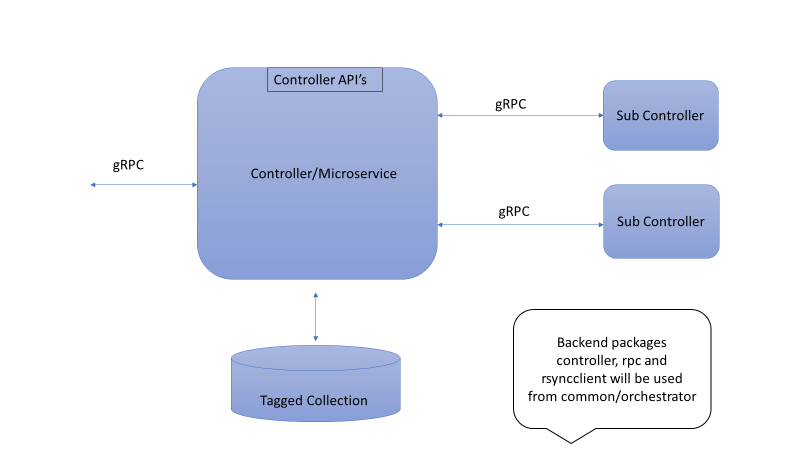

```text
SPDX-License-Identifier: Apache-2.0
Copyright (c) 2020-2021 Intel Corporation
```
<!-- omit in toc -->

# Sub Controller Framework in EMCO

Sub controller framework in EMCO provides an easy way to add sub controllers. These sub controllers are independent microservices that provide specific service, and can be added by external and internal developers. This document provides steps and guidelines to create and add new sub controllers.

- **Architecture**
- **Registration APIs Implementation**
- **gRPC Callouts**
- **Additional References**

## Architecture



The controller that wants to support sub controllers, adds the frontend controller APIs for POST, PUT, GET and DELETE which will call into the backend controller packages.  Similarly, gRPC frontend messages can be either implemented by the controller or can be used from the common orchestrator package. If the sub controller needs to interact with rsync directly, it can use the rsyncclient common package.  The registration APIs will store the data under the collection chosen through controller client instance. When the controller receives a gRPC call, it would go through the registered sub controller list and call them based on their priority.  The sub controller will be new microservice servicing the gRPC call.

## Registration APIs Implementation

As part of the registration API call, host, port, type, and priority are passed in, this data is stored in the database through controller package.

```
Controller info:
    {
        “host”: <node ip>
        “port”: <port number>
        “type”: <controller type>
        “priority”: <1 to 100>
    }
```
This handler module imports the controller package @EMCO/src/orchestrator/pkg/module/controller and creates a client using.

```
    client.Controller = controller.NewControllerClient(<collection name>, <tagmetadata>)
```

The handler functions for create, get, put, and delete are added, refer to [example](../../src/dtc/api/controllerhandler.go) for details.

## gRPC Callouts 

gRPC proto buffs and contextupdate packages can be used from common packages @EMCO/src/orchestrator/pkg/grpc or can implement its own messages based on the service being offered.

**Example code implementing the callout:**


```
func (cs *contextupdateServer) UpdateAppContext(ctx context.Context, req *contextpb.ContextUpdateRequest) (*contextpb.ContextUpdateResponse, error) {
	log.Info("Received Update App Context request", log.Fields{
		"AppContextId": req.AppContext,
		"IntentName":   req.IntentName,
	})

	cc := controller.NewControllerClient("dtccontroller", "dtccontrollermetadata")
	clist, err := cc.GetControllers()
	if err != nil {
                log.Error("Error getting controllers", log.Fields{
                        "error": err,
                })
		return &contextpb.ContextUpdateResponse{AppContextUpdated: false, AppContextUpdateMessage: fmt.Sprintf("Error getting controllers for intent %v and Id: %v", req.IntentName, req.AppContext)}, err
	}

	// Sort the list based on priority
	sort.SliceStable(clist, func(i, j int) bool {
		return clist[i].Spec.Priority > clist[j].Spec.Priority

	})

	for _, c := range clist {
		fmt.Printf("sub controller name = %s", c.Metadata.Name)
		err := client.InvokeContextUpdate(c.Metadata.Name, req.IntentName, req.AppContext)
		if err != nil {
			fmt.Printf("invoke context update failed for controller = %v", c)

		}
	}

	return &contextpb.ContextUpdateResponse{AppContextUpdated: true, AppContextUpdateMessage: fmt.Sprintf("Successful application of intent %v to %v", req.IntentName, req.AppContext)}, nil
}
```
## Additional References

[Example DTC sub controller's doc](./dtc_subcontrollers.md)\
[Refer to nps sub controller example](../../src/nps/)\
[Guidelines for adding microservice](./Guidelines_adding_microservices_to_emco.md)

