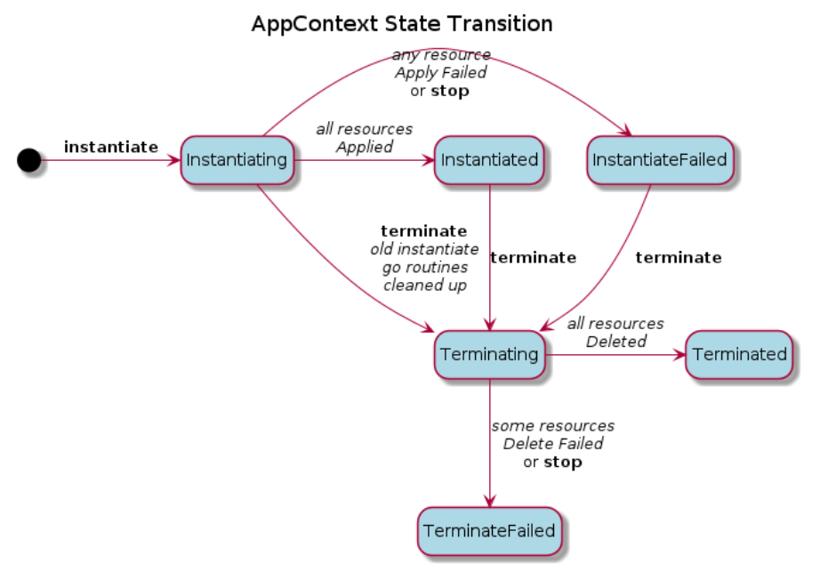
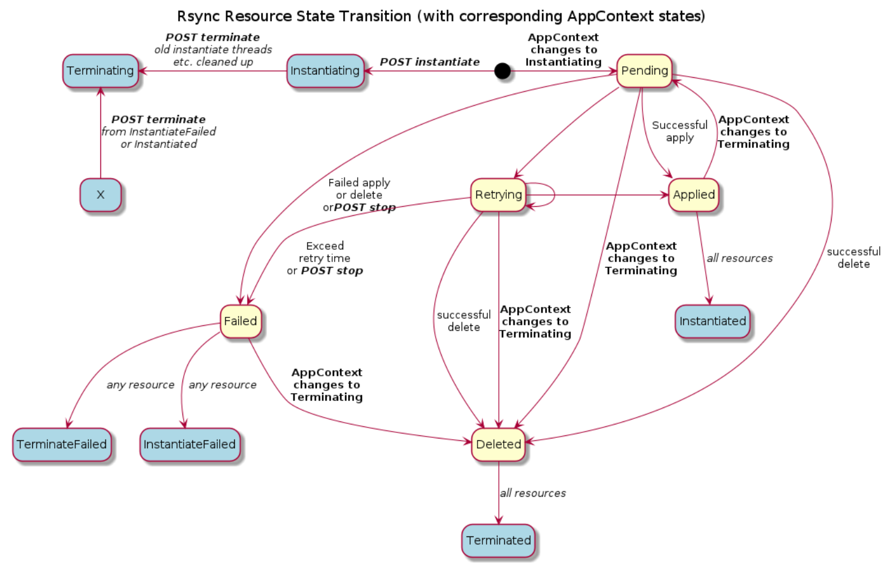

```text
SPDX-License-Identifier: Apache-2.0       
Copyright (c) 2020 Intel Corporation
```

## EMCO Resource Lifecycle Management
This document describes the lifecycle operations of EMCO resources which are used to interact with the EMCO rsync microservice and result in application resources being deployed in remote Kubernetes clusters.  The EMCO rsync microservice is invoked by other EMCO microservices which manage EMCO resources with a lifecycle.  EMCO rsync handles instantiating and terminating the Kubernetes resources associated with the EMCO resource as well as maintain status information for the resources.
### EMCO Resources with a Lifecycle
- Cluster Network Intents
	- Lifecycle operations are issued via the Network Configuration Manager (ncm) API to apply network intents (creation of provider or virtual networks) to a cluster.
- Deployment Intent Groups
	- Lifecycle operations are issued via the Distributed Application Scheduler (orchestrator) API to approve and instantiate composite applications which have been associated, along with a set of various intents, to a Deployment Intent Group instance.
- Logical Clouds
	- Lifecycle operations are issued via the Distributed Cluster Manager (dcm) to instantiate logical clouds.

### Terminology
This document will refer to _EMCO resources_ , _AppContext_ , _rsync resources_ , and _cluster resources_ .

- **EMCO resources** : These are the data resources that are input to various EMCO microservices via the REST APIs.  This data is generally input as JSON or file data and is stored in the EMCO database (i.e. MongoDB).  EMCO resources include the onboarded cluster registration data, logical clouds, network intents, composite application data, placement intents, action controller intents and so on.
- **AppContext** : The AppContext is the etcd storage used by EMCO to stage and maintain resources for composite applications, network intents and logical clouds.  Basically, all resources that are to be deployed to the remote clusters are prepared in the AppContext by various EMCO microservices and the Resource Synchronizer (rsync) microservice handles applying and removing those resources in the remote clusters.  Generally, for EMCO resources that support lifecycle operations, an AppContext entry is created that is used to manage and track all of the resources associated with the EMCO resource and status information.
- **rsync resource** - This term is used to refer to a Kubernetes resource that has been prepared by the EMCO microservices in an AppContext entry.  The _rsync resource_ will have a status, managed by _rsync_ with respect to the lifecycle operations and whether or not _rsync_ has executed the operation to the associated remote cluster.
- **cluster resource** - This term is used to refer to the actual instance of Kubernetes resource resource in a remote cluster.  A _cluster resource_ has an association with a  _rsync resource_.  Though not necessary 1:1.  For example, the _rsync resource_ may be a Deployment.  In the cluster, there would be Deployment and Pod  _cluster resources_ that get instantiated after the _rsync resource_ is applied to the cluster.

### Cluster Network Intent lifecycle

The state of the Cluster Network Intents is maintained in the Cluster resource in the EMCO database. This _state_ is tracking the operation issued to the resource via the API. The states are:

-   **Created**: Upon initial creation of the cluster. In this state, Network Intents may be added to the cluster.
-   **Applied**: Once applied, the network intents are rendered to create appropriate _rsync resources_  in the AppContext and rsync is then invoked to instantiates these to the cluster to create  _cluster resources_.

```
	URL: POST /v2/cluster-providers/{cluster-provider-name}/clusters/{cluster-name}/apply
```

	In this state (for now), additional network intents may not be added, modified or deleted until the current ones are terminated.

	The cluster resource deleted from the EMCO database as well, until the current network intents are terminated.

-   **Terminated**: Causes  _rsync_ to delete the  _cluster resources_  from the destination clusters.

```
	URL: POST /v2/cluster-providers/{cluster-provider-name}/clusters/{cluster-name}/terminate
```

	This state is effectively similar to the Created state - network intents may be added, modified or deleted.

	The cluster resource itself may be deleted (subject to deleting sub-resources first).

	The Applied state may also be re-invoked to start a new set of  _rsync resources_  and  _cluster resources_.

-   **InstantiateStopped**: Causes  _rsync_  to stop any current instantiation operations for the associated AppContext.
	When _rsync_ continues to retry instantiating _rsync resources_ to a specific cluster because it has become unreachable, the stop API may be invoked to cause the instantiate process to complete.

	Note: In the case of a some clusters in a retrying condition during instantiate, issuing a terminate to the DIG will also stop the instantiate sequence before beginning the termination process.

```
	URL: /v2/projects/{project-name}/composite-apps/{composite-app-name}/{version}/deployment-intent-groups/{deployment-intent-group-name}/stop
```

-   **TerminateStopped**: Causes  _rsync_  to stop any current termination operations for the associated AppContext.
	When _rsync_ continues to retry deleting _rsync resources_ from a specific cluster because it has become unreachable, the stop API may be invoked to cause the terminate process to complete.
	This may be necessary if it is known that the retry condition cannot be resolved and there is an intent to delete the DIG.  EMCO will prevent removal of the DIG until it has been terminated and the termination operation has completed (or failed).

```
	URL: /v2/projects/{project-name}/composite-apps/{composite-app-name}/{version}/deployment-intent-groups/{deployment-intent-group-name}/stop
```


### Deployment Intent Group lifecycle

The state of the Deployment Intent Group (DIG) is maintained in the Deployment Intent Group resource in the EMCO database. This _state_ is tracking the operation issued to the resource via the API. The states are:

-   **Created**: Upon creation of the DIG, intents may be added to the DIG. The DIG may be modified or deleted.
-   **Approved**: Once the DIG is Approved, the DIG and its intents may not be modified or deleted. Modifying the DIG or its intents will unapprove the DIG and set it back to the Created state.

```
	URL: /v2/projects/{project-name}/composite-apps/{composite-app-name}/{version}/deployment-intent-groups/{deployment-intent-group-name}/approve
```

-   **Instantiated**: When the DIG is Instantiated, the  _rsync resources_  are created in the EMCO AppContext and the  _rsync_  is invoked to create the  _cluster resources_  in the destination clusters.

```
	URL: /v2/projects/{project-name}/composite-apps/{composite-app-name}/{version}/deployment-intent-groups/{deployment-intent-group-name}/instantiate
```

	Once instantiated, the DIG and its intents may not be modified or deleted. The DIG must be Terminated first.

-   **Terminated**: Causes  _rsync_  to delete the  _cluster resources_  from the destination clusters.

```
	URL: /v2/projects/{project-name}/composite-apps/{composite-app-name}/{version}/deployment-intent-groups/{deployment-intent-group-name}/terminate
```

	This state is effectively similar to the Approved state.

	The Instantiated state may be re-invoked to start a new set of  _rsync resources_ and  _cluster resources_.

-   **InstantiateStopped**: Causes  _rsync_  to stop any current instantiation operations for the associated AppContext.
	When _rsync_ continues to retry instantiating _rsync resources_ to a specific cluster because it has become unreachable, the stop API may be invoked to cause the instantiate process to complete.

	Note: In the case of a some clusters in a retrying condition during instantiate, issuing a terminate to the DIG will also stop the instantiate sequence before beginning the termination process.

```
	URL: /v2/projects/{project-name}/composite-apps/{composite-app-name}/{version}/deployment-intent-groups/{deployment-intent-group-name}/stop
```

-   **TerminateStopped**: Causes  _rsync_  to stop any current termination operations for the associated AppContext.
	When _rsync_ continues to retry deleting _rsync resources_ from a specific cluster because it has become unreachable, the stop API may be invoked to cause the terminate process to complete.
	This may be necessary if it is known that the retry condition cannot be resolved and there is an intent to delete the DIG.  EMCO will prevent removal of the DIG until it has been terminated and the termination operation has completed (or failed).

```
	URL: /v2/projects/{project-name}/composite-apps/{composite-app-name}/{version}/deployment-intent-groups/{deployment-intent-group-name}/stop
```

### Logical Cloud lifecycle

In the initial EMCO release, logical clouds do not maintain the lifecycle _state_ in their EMCO resource, but the implementation effectively supports the **Create**, **Instantiate** and **Terminate** lifecycle operations.  The **Stop** operations are not supported yet.


### EMCO Resource State Diagram
The following diagram illustrates how the states of Deployment Intent Groups work.  The states of the EMCO resource (Deployment Intent Group) are shown in green.  The light blue statuses inside the Instantiated, InstantiateStopped, Terminated, and TerminateStopped states represent the status of the associated AppContext.

Note: The state diagram for cluster network intents is similar.  Just lacking the Approved state and the Instantiated is called Applied for cluster network intents..


## AppContext State

The rsync process will maintain a top level state for the AppContext. The states are:

-   **Instantiating**: Once _rsync_  is invoked to instantiate an AppContext, the state will be set to _Instantiating_.
-   **Instantiated**: _Rsync_  will set the .AppContext state to _Instantiated_  after all Resources in the AppContext have been _Applied_.
-   **InstantiateFailed**: This indicates that one or more Resources _Failed_  to be applied. Or, the instantiation sequence was stopped.
-   **Terminating**: When terminate is invoked, this state will be entered directly if the AppContext is in _Instantiated_  or _InstantiateFailed_  state. If a previous Instantiating sequence is still running, the transition process includes shutting down the instantiating sequence before entering the Terminating state.
-   **Terminated**: This indicates that  _rsync_  has successfully _Deleted_  all resources.
-   **TerminateFailed**: This indicates that  _rsync_  has received a failure response for one or more Resources when attempting to delete them.  Or, the termination sequence was stopped.

The following diagram illustrates how the top level AppContext status progresses.

Note: Once an EMCO resource has been instantiated (or applied), it will have an AppContext created for it and the EMCO resource cannot be deleted until the associated AppContext has reached a Terminated or TerminateFailed status.
  


## _Rsync resource_  state values

The status of the  _rsync resource_  is maintained in the AppContext by  _rsync._ The status values are defined as follows.

-   **Pending**: Upon initial creation by _ncm_ (for cluster network intents) or _orchestrator_ (for DIGs), the _rsync resources_ will be initialized to a Pending status to indicate they have not been handled by _rsync_ yet.
-   **Applied**: This indicates that  _rsync_  has successfully applied the  _rsync resource_  to its destination cluster. This does not indicate anything about the actual status of the corresponding  _cluster resource(s)_  in the remote cluster.
-   **Failed**: This indicates that  _rsync_  has received a failure response when either attempting to apply or delete the  _rsync resource_  from the destination cluster. _rsync_ is taking no further action with this resource.
-   **Retrying**: This indicates that  _rsync_  is continuing to attempt to apply or delete the  _rsync resource_  from the destination cluster. This may occur because connectivity to the destination cluster is currently unavailable, but may resume at a later time. This will continue until a different lifecyle state is invoked on the controlling EMCO resource - such as terminate or stop.
-   **Terminated**: This indicates that  _rsync_  has successfully deleted the  _rsync resource_ from the destination cluster. This does not indicate anything about the actual status of the corresponding  _cluster resource(s)_ in the remote cluster.

The following diagram illustrates the various _rsync resource_ status transitions (pale yellow) with respect to the overall AppContext status transitions (light blue).
  


## _Cluster resource_ status

The status of resources deployed by  _rsync_  to clusters is monitored by aggregating their status in a Custom Resource, called the ResourceBundleState CR, which is provided along with the _monitor_ microservice.  The ResourceBundleState CR is essentially an array of about a dozen common Kubernetes kinds (eg. Pod, Deployment, Service, ConfigMap, etc.).  The _monitor_ microservice updates a given ResourceBundleState CR instance with status updates of resources in the cluster which have a label matching that instance.

1.  When  _rsync_  instantiates  _rsync resources_, it will also instantiate a ResourceBundleState CR to the remote cluster. For a given Composite Application, a ResourceBundleState CR will be deployed for each App (in the Composite App) per cluster. A label will be applied by  _rsync_ to all  _cluster resources_  of a given App and will be matched by label to the corresponding ResourceBundleState CR in the cluster. The label format is:
```
	"emco/deployment-id: < AppContext identifier>-< app-name >"
```
2.  A 'monitor' pod is present in each cluster (must be installed previously) with the function to monitor all resources with the "emco/deployement-id" label. When it detects changes to those resources, it will update the matching ResourceBundleState CR with the details of the resource. In the example ResourceBundleState CR below, for example, all pod resources that are labeled with emco/deployment-id: 171887448792644816-sink will be included in the 'podStatuses' array.
```
apiVersion: k8splugin.io/v1alpha1
kind: ResourceBundleState
metadata:
  labels:
    emco/deployment-id: 171887448792644816-sink
  name: sink-171887448792644816
  namespace: default
spec:
  selector:
    matchLabels:
      emco/deployment-id: 171887448792644816-sink
status:
  ready: false
  resourceCount: 0
  configMapStatuses: []
  daemonSetStatuses: []
  deploymentStatuses: []
  ingressStatuses: []
  jobStatuses: []
  podStatuses: []
  secretStatuses: []
  serviceStatuses: []
  statefulSetStatuses: []
```
3.  A Watcher thread is started per cluster by _rsync_ to watch for changes to ResourceBundleState CRs in the cluster. When an updated CR is detected, the Watcher retrieves it and saves it into the corresponding AppContext per App/Cluster so it is available to provide information for _cluster resource_ queries.
    

The  _cluster resource_ status is provided in two forms.

1.  The actual status{} portion of the  _cluster resource_  (if present) is made available in the information returned via the ResourceBundleState CR.
2.  Summarized in a value as follows.

-   **Present**: For  _rsync resources_  with a corresponding  _cluster resource_  in the ResourceBundleState CR, the clustesr status is present.


### Status Query
The status query, and variations with query parameters, on an EMCO resource will present the information described previously to the caller.  The basic status query for the two EMCO resources discussed above will look like the following:

```
URL:  GET /v2/cluster-providers/{cluster-provider-name}/clusters/{cluster-name}/status

URL:  GET /v2/projects/{project-name}/composite-apps/{composite-app-name}/{version}/deployment-intent-groups/{deployment-intent-group-name}/status
```

Note: in the initial EMCO release, logical clouds do not support the status API.


#### Status Query Parameters

The following query parameters are available:

type=_< rsync | cluster >_
* default type is 'rsync'
* rsync: gathers status based on the rsync resources.
* cluster: gathers status based on cluster resource information received in the ResourceBundleState CRs received from the cluster(s)

output=_< summary | all | detail >_
* default output value is: 'all'
* summary: will just show the top level EMCO resource state and status along with aggregated resource statuses but no resource detail information
  any filters added will affect the aggregated resource status results, although resource details will not be displayed
* all: will include a list of resources, organized by App and Cluster, showing basic resource identification (Group Version Kind) and resource statuses
* detail: includes in the resource list the metadata, spec, and status of the resource as received in the ResourceBundleState CR


The following query parameters filter the results returned.  Aggregated status results at the top level are relative to the filter parameters supplied
These parameters can be supplied multiple times in a given status query.

app=_< appname >_
* default is all apps
* This will filter the results of the query to show results only for the resources of the specified App(s).

cluster=_< cluster >_
* default is all clusters
* This will filter the results of the query to show results only for the specified cluster(s)

resource=_< resource name >_
* default is all resources
* This will filter the results of the query to show results only for the specified resource(s)


#### Status Query Examples

Basic status query.  By default, all apps, clusters and resources will be displayed.  The default query type is 'rsync', so the status returned indicates
the status of whether or not EMCO has successfully applied or terminated the resources (not the actual resource status in the cluster).
```
URL: GET /v2/projects/proj1/composite-apps/collection-composite-app/v1/deployment-intent-groups/collection-deployment-intent-group/status

```

Query showing just the summary information of the Deployment Intent Group.
```
URL: GET /v2/projects/proj1/composite-apps/collection-composite-app/v1/deployment-intent-groups/collection-deployment-intent-group/status?output=summary

```
Query showing the detailed status of two resources in a given cluster.
Note that the cluster is specified as the 'clusterprovider+cluster'.  The '+' is represented in ascii notation %2B.
```
URL: GET /v2/projects/proj1/composite-apps/collection-composite-app/v1/deployment-intent-groups/collection-deployment-intent-group/status?resource=alertmanagers.monitoring.coreos.com&resource=servicemonitors.monitoring.coreos.com&output=all&cluster=provider1%2Bcluster1&output=detail

```

#### Output Examples:
Illustrates the type of output that appears given various query parameters.

##### Example summary query

```
URL: /v2/projects/testvfw/composite-apps/compositevfw/v1/deployment-intent-groups/vfw_deployment_intent_group/status?output=summary
{
  "project": "testvfw",
  "composite-app-name": "compositevfw",
  "composite-app-version": "v1",
  "composite-profile-name": "vfw_composite-profile",
  "name": "vfw_deployment_intent_group",
  "state": {
    "Actions": [
      {
        "State": "Created",
        "ContextId": "",
        "TimeStamp": "2020-08-21T05:36:54.186Z"
      },
      {
        "State": "Approved",
        "ContextId": "",
        "TimeStamp": "2020-08-21T05:37:28.748Z"
      },
      {
        "State": "Instantiated",
        "ContextId": "2621114006130701074",
        "TimeStamp": "2020-08-21T05:37:28.947Z"
      },
      {
        "State": "Terminated",
        "ContextId": "2621114006130701074",
        "TimeStamp": "2020-08-21T05:38:51.061Z"
      },
      {
        "State": "Approved",
        "ContextId": "",
        "TimeStamp": "2020-08-21T05:39:34.436Z"
      },
      {
        "State": "Instantiated",
        "ContextId": "2755581958183303505",
        "TimeStamp": "2020-08-21T05:39:34.64Z"
      }
    ]
  },
  "status": "Instantiated",
  "rsync-status": {
    "Applied": 12
  }
}
```

##### Example query with default parameters
```
URL:/v2/projects/testvfw/composite-apps/compositevfw/v1/deployment-intent-groups/vfw_deployment_intent_group/status
{
  "project": "testvfw",
  "composite-app-name": "compositevfw",
  "composite-app-version": "v1",
  "composite-profile-name": "vfw_composite-profile",
  "name": "vfw_deployment_intent_group",
  "state": {
    "Actions": [
      {
        "State": "Created",
        "ContextId": "",
        "TimeStamp": "2020-08-21T05:36:54.186Z"
      },
      {
        "State": "Approved",
        "ContextId": "",
        "TimeStamp": "2020-08-21T05:37:28.748Z"
      },
      {
        "State": "Instantiated",
        "ContextId": "2621114006130701074",
        "TimeStamp": "2020-08-21T05:37:28.947Z"
      },
      {
        "State": "Terminated",
        "ContextId": "2621114006130701074",
        "TimeStamp": "2020-08-21T05:38:51.061Z"
      },
      {
        "State": "Approved",
        "ContextId": "",
        "TimeStamp": "2020-08-21T05:39:34.436Z"
      },
      {
        "State": "Instantiated",
        "ContextId": "2755581958183303505",
        "TimeStamp": "2020-08-21T05:39:34.64Z"
      }
    ]
  },
  "status": "Instantiated",
  "rsync-status": {
    "Applied": 12
  },
  "apps": [
    {
      "name": "packetgen",
      "clusters": [
        {
          "cluster-provider": "vfw-cluster-provider",
          "cluster": "edge01",
          "resources": [
            {
              "GVK": {
                "Group": "apps",
                "Version": "v1",
                "Kind": "Deployment"
              },
              "name": "fw0-packetgen",
              "rsync-status": "Applied"
            },
            {
              "GVK": {
                "Group": "",
                "Version": "v1",
                "Kind": "Service"
              },
              "name": "packetgen-service",
              "rsync-status": "Applied"
            }
          ]
        },
        {
          "cluster-provider": "vfw-cluster-provider",
          "cluster": "edge02",
          "resources": [
            {
              "GVK": {
                "Group": "apps",
                "Version": "v1",
                "Kind": "Deployment"
              },
              "name": "fw0-packetgen",
              "rsync-status": "Applied"
            },
            {
              "GVK": {
                "Group": "",
                "Version": "v1",
                "Kind": "Service"
              },
              "name": "packetgen-service",
              "rsync-status": "Applied"
            }
          ]
        }
      ]
    },
    {
      "name": "firewall",
      "clusters": [
        {
          "cluster-provider": "vfw-cluster-provider",
          "cluster": "edge01",
          "resources": [
            {
              "GVK": {
                "Group": "apps",
                "Version": "v1",
                "Kind": "Deployment"
              },
              "name": "fw0-firewall",
              "rsync-status": "Applied"
            }
          ]
        },
        {
          "cluster-provider": "vfw-cluster-provider",
          "cluster": "edge02",
          "resources": [
            {
              "GVK": {
                "Group": "apps",
                "Version": "v1",
                "Kind": "Deployment"
              },
              "name": "fw0-firewall",                                                                                                                                                                              
              "rsync-status": "Applied"
            }
          ]
        }
      ]
    },
    {
      "name": "sink",
      "clusters": [
        {
          "cluster-provider": "vfw-cluster-provider",
          "cluster": "edge01",
          "resources": [
            {
              "GVK": {
                "Group": "apps",
                "Version": "v1",
                "Kind": "Deployment"
              },
              "name": "fw0-sink",
              "rsync-status": "Applied"
            },
            {
              "GVK": {
                "Group": "",
                "Version": "v1",
                "Kind": "ConfigMap"
              },
              "name": "sink-configmap",
              "rsync-status": "Applied"
            },
            {
              "GVK": {
                "Group": "",
                "Version": "v1",
                "Kind": "Service"
              },
              "name": "sink-service",
              "rsync-status": "Applied"
            }
          ]
        },
        {
          "cluster-provider": "vfw-cluster-provider",
          "cluster": "edge02",
          "resources": [
            {
              "GVK": {
                "Group": "apps",
                "Version": "v1",
                "Kind": "Deployment"
              },
              "name": "fw0-sink",
              "rsync-status": "Applied"
            },
            {
              "GVK": {
                "Group": "",
                "Version": "v1",
                "Kind": "ConfigMap"
              },
              "name": "sink-configmap",
              "rsync-status": "Applied"
            },
            {
              "GVK": {
                "Group": "",
                "Version": "v1",
                "Kind": "Service"
              },
              "name": "sink-service",
              "rsync-status": "Applied"
            }
          ]
        }
      ]
    }
  ]
}
```

##### Example with a cluster filter parameter

```
URL: /v2/projects/testvfw/composite-apps/compositevfw/v1/deployment-intent-groups/vfw_deployment_intent_group/status?cluster=vfw-cluster-provider%2Bedge02
{
  "project": "testvfw",
  "composite-app-name": "compositevfw",
  "composite-app-version": "v1",
  "composite-profile-name": "vfw_composite-profile",
  "name": "vfw_deployment_intent_group",
  "state": {
    "Actions": [
      {
        "State": "Created",
        "ContextId": "",
        "TimeStamp": "2020-08-21T18:17:03.503Z"
      },
      {
        "State": "Approved",
        "ContextId": "",
        "TimeStamp": "2020-08-21T18:17:18.037Z"
      },
      {
        "State": "Instantiated",
        "ContextId": "3983785381246146818",
        "TimeStamp": "2020-08-21T18:17:18.275Z"
      }
    ]
  },
  "status": "Instantiated",
  "rsync-status": {
    "Applied": 6
  },
  "apps": [
    {
      "name": "packetgen",
      "clusters": [
        {
          "cluster-provider": "vfw-cluster-provider",
          "cluster": "edge02",
          "resources": [
            {
              "GVK": {
                "Group": "apps",
                "Version": "v1",
                "Kind": "Deployment"
              },
              "name": "fw0-packetgen",
              "rsync-status": "Applied"
            },
            {
              "GVK": {
                "Group": "",
                "Version": "v1",
                "Kind": "Service"
              },
              "name": "packetgen-service",
              "rsync-status": "Applied"
            }
          ]
        }
      ]
    },
    {
      "name": "firewall",
      "clusters": [
        {
          "cluster-provider": "vfw-cluster-provider",
          "cluster": "edge02",
          "resources": [
            {
              "GVK": {
                "Group": "apps",
                "Version": "v1",
                "Kind": "Deployment"
              },
              "name": "fw0-firewall",
              "rsync-status": "Applied"
            }
          ]
        }
      ]
    },
    {
      "name": "sink",
      "clusters": [
        {
          "cluster-provider": "vfw-cluster-provider",
          "cluster": "edge02",
          "resources": [
            {
              "GVK": {
                "Group": "apps",
                "Version": "v1",
                "Kind": "Deployment"
              },
              "name": "fw0-sink",
              "rsync-status": "Applied"
            },
            {
              "GVK": {
                "Group": "",
                "Version": "v1",
                "Kind": "ConfigMap"
              },
              "name": "sink-configmap",
              "rsync-status": "Applied"
            },
            {
              "GVK": {
                "Group": "",
                "Version": "v1",
                "Kind": "Service"
              },
              "name": "sink-service",
              "rsync-status": "Applied"
            }
          ]
        }
      ]
    }
  ]
}

```

##### Example of a cluster network intents status query

All the same query parameters apply.

Note: if the type=cluster query is made, the ResourceBundleState CR currently does not support the Network and ProviderNetwork resources, so no resources will be found

```
URL: /v2/cluster-providers/vfw-cluster-provider/clusters/edge01/status
{
  "name": "vfw-cluster-provider+edge01",
  "state": {
    "Actions": [
      {
        "State": "Created",
        "ContextId": "",
        "TimeStamp": "2020-08-21T18:17:02.464Z"
      },
      {
        "State": "Applied",
        "ContextId": "9116473999070524329",
        "TimeStamp": "2020-08-21T18:17:11.983Z"
      }
    ]
  },
  "status": "Instantiated",
  "rsync-status": {
    "Applied": 3
  },
  "apps": [
    {
      "name": "network-intents",
      "clusters": [
        {
          "cluster-provider": "vfw-cluster-provider",
          "cluster": "edge01",
          "resources": [
            {
              "GVK": {
                "Group": "k8s.plugin.opnfv.org",
                "Version": "v1alpha1",
                "Kind": "ProviderNetwork"
              },
              "name": "emco-private-net",
              "rsync-status": "Applied"
            },
            {
              "GVK": {
                "Group": "k8s.plugin.opnfv.org",
                "Version": "v1alpha1",
                "Kind": "Network"
              },
              "name": "protected-private-net",
              "rsync-status": "Applied"
            },
            {
              "GVK": {
                "Group": "k8s.plugin.opnfv.org",
                "Version": "v1alpha1",
                "Kind": "ProviderNetwork"
              },
              "name": "unprotected-private-net",
              "rsync-status": "Applied"
            }
          ]
        }
      ]
    }
  ]
}
```
